# Design Modelling

## UML Models Overview

This document provides comprehensive visual models representing the architecture and behavior of the AI-Powered Credit-Based Learning Platform. These UML diagrams translate the functional and non-functional requirements from [spec.md](.propel/context/docs/spec.md) and architectural decisions from [design.md](.propel/context/docs/design.md) into visual artifacts for development, communication, and documentation.

**Purpose:**
- **Architectural Views**: Provide system-level understanding through Context, Component, Deployment, and Data Flow diagrams
- **Data Modeling**: Define entity relationships and database structure via ERD
- **Behavioral Specifications**: Detail interaction flows for each use case through sequence diagrams
- **Traceability**: Link visual models to source requirements (UC-XXX, FR-XXX, NFR-XXX)

**Document Navigation:**
1. **Architectural Views** (Section 2): High-level system structure and deployment
2. **Logical Data Model** (Section 3): Entity relationships and database schema
3. **Use Case Sequence Diagrams** (Section 4): Detailed message flows for UC-001 through UC-008

**Alignment:**
- All diagrams reflect the **microservices architecture** with domain-driven design bounded contexts as defined in design.md
- Technology stack: **ASP.NET Core 8.0 + PostgreSQL 14 + React 18 + Python ML** (FastAPI)
- Deployment target: **Azure Cloud** with AKS, managed PostgreSQL, Redis, and Blob Storage
- Compliance: **OWASP security standards**, **RBAC**, **SSO authentication**

---

## Architectural Views

### System Context Diagram

The system context diagram shows the AI Learning Platform's boundary, its primary function (upskilling organization in AI through credit-based learning), and interactions with external actors and systems via data flows.

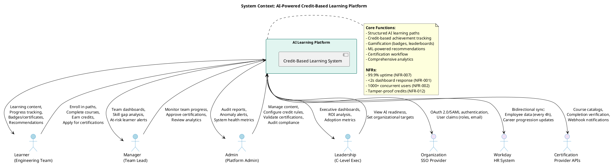

**Diagram Explanation:**
- **Primary Actors**: Learners, Managers, Admins, and Leadership interact with the platform for different purposes aligned with their roles (FR-003)
- **External Systems**: Mandatory SSO integration (NFR-004), Workday sync (FR-002, NFR-013), and Certification Provider APIs (FR-024)
- **Data Flows**: Bidirectional communication showing inputs from users and outputs/feedback from system
- **Security Boundary**: All external integrations use secure protocols (OAuth 2.0, HTTPS, API keys)

---

### Component Architecture Diagram

This diagram decomposes the system into microservices following domain-driven design bounded contexts, showing responsibilities, interfaces, and communication paths.

```mermaid
flowchart TB
    subgraph "Presentation Layer - Azure Static Web App"
        direction LR
        WebApp["React 18 SPA<br/>(TypeScript + Redux)"]
        WebApp --> |"HTTPS"| Gateway
    end
    
    subgraph "API Gateway Layer - Azure API Management"
        Gateway["API Gateway<br/>(Rate Limiting,<br/>JWT Validation,<br/>Routing)"]
    end
    
    subgraph "Backend Services - AKS (Kubernetes)"
        direction TB
        
        subgraph UserService["User Service<br/>(ASP.NET Core)"]
            US1["Authentication<br/>(SSO Integration)"]
            US2["Profile Mgmt<br/>(FR-004)"]
            US3["RBAC<br/>(FR-003)"]
        end
        
        subgraph LearningService["Learning Service<br/>(ASP.NET Core)"]
            LS1["Learning Paths<br/>(FR-005)"]
            LS2["Course Enrollment<br/>(FR-006, FR-008)"]
            LS3["Progress Tracking<br/>(Auto-save)"]
        end
        
        subgraph CreditService["Credit Service<br/>(ASP.NET Core)"]
            CS1["Credit Calculation<br/>(FR-010, FR-011)"]
            CS2["Transaction Recording<br/>(SHA-256 Hash)"]
            CS3["Verification API<br/>(FR-012)"]
        end
        
        subgraph GamificationService["Gamification Service<br/>(ASP.NET Core)"]
            GS1["Badge Engine<br/>(FR-015, FR-016)"]
            GS2["Leaderboard<br/>(FR-017, FR-018)"]
            GS3["Tier Progression<br/>(FR-019)"]
        end
        
        subgraph CertificationService["Certification Service<br/>(ASP.NET Core)"]
            CERT1["Application Workflow<br/>(FR-020)"]
            CERT2["Manager Approval<br/>(FR-021)"]
            CERT3["Provider Integration<br/>(FR-024)"]
        end
        
        subgraph AnalyticsService["Analytics Service<br/>(ASP.NET Core)"]
            AN1["Manager Dashboard<br/>(FR-030)"]
            AN2["Leadership Dashboard<br/>(FR-033)"]
            AN3["Reporting API<br/>(FR-035)"]
        end
        
        subgraph MLService["ML Service<br/>(Python FastAPI)"]
            ML1["Recommendation Engine<br/>(FR-009, AIR-001)"]
            ML2["Skill Gap Analysis<br/>(FR-032, AIR-002)"]
            ML3["At-Risk Prediction<br/>(AIR-003)"]
        end
        
        subgraph BackgroundJobs["Background Jobs<br/>(Hangfire/.NET)"]
            BG1["Workday Sync<br/>(Every 4h)"]
            BG2["Leaderboard Refresh<br/>(Every 5 min)"]
            BG3["ML Training<br/>(Weekly)"]
        end
    end
    
    subgraph "Data Layer - Azure Managed Services"
        direction LR
        PostgreSQL[("PostgreSQL 14<br/>(Primary DB)<br/>- User, Course, Credit<br/>- Materialized Views")]
        Redis[("Redis 7.x<br/>(Cache)<br/>- Leaderboards<br/>- Recommendations<br/>- Sessions")]
        BlobStorage[("Azure Blob<br/>(Files)<br/>- Certifications<br/>- Course Materials<br/>- Badges")]
        MessageQueue["RabbitMQ<br/>(Events)<br/>- Credit Awarded<br/>- Badge Unlocked"]
    end
    
    subgraph "External Systems"
        SSOProvider["Organization SSO<br/>(OAuth 2.0/SAML)"]
        WorkdayAPI["Workday HR API<br/>(Employee Data)"]
        CertAPI["Certification Provider<br/>(Coursera, Udacity)"]
    end
    
    Gateway --> UserService
    Gateway --> LearningService
    Gateway --> CreditService
    Gateway --> GamificationService
    Gateway --> CertificationService
    Gateway --> AnalyticsService
    Gateway --> MLService
    
    UserService --> PostgreSQL
    UserService --> Redis
    UserService --> SSOProvider
    
    LearningService --> PostgreSQL
    LearningService --> Redis
    LearningService --> BlobStorage
    
    CreditService --> PostgreSQL
    CreditService --> MessageQueue
    
    GamificationService --> Redis
    GamificationService --> PostgreSQL
    GamificationService <-.->|"Subscribe"| MessageQueue
    
    CertificationService --> PostgreSQL
    CertificationService --> BlobStorage
    CertificationService --> CertAPI
    
    AnalyticsService --> PostgreSQL
    AnalyticsService --> Redis
    
    MLService --> PostgreSQL
    MLService --> Redis
    
    BackgroundJobs --> WorkdayAPI
    BackgroundJobs --> PostgreSQL
    BackgroundJobs --> Redis
    BackgroundJobs --> MLService
    
    style WebApp fill:#4FC3F7,stroke:#0277BD,stroke-width:2px
    style Gateway fill:#FFB74D,stroke:#F57C00,stroke-width:2px
    style PostgreSQL fill:#81C784,stroke:#388E3C,stroke-width:2px
    style Redis fill:#FF8A65,stroke:#D84315,stroke-width:2px
    style MessageQueue fill:#BA68C8,stroke:#7B1FA2,stroke-width:2px
```

**Component Responsibilities:**
- **User Service**: SSO authentication (NFR-004), profile management, RBAC enforcement (NFR-006)
- **Learning Service**: Course catalog, enrollment, progress auto-save (NFR-003)
- **Credit Service**: Tamper-proof credit transactions with SHA-256 hashing (NFR-012)
- **Gamification Service**: Real-time leaderboard updates via event subscription (NFR-015)
- **Certification Service**: Provider API integration with fallback to manual workflow (FR-024)
- **Analytics Service**: Pre-computed dashboards using materialized views (NFR-001)
- **ML Service**: Python-based recommendations served via FastAPI (AIR-001, AIR-006)
- **Background Jobs**: Scheduled tasks for Workday sync, leaderboard refresh, ML training

**Technology Alignment:**
- **ASP.NET Core 8.0**: All backend services except ML (TR-002)
- **PostgreSQL 14**: ACID transactions, materialized views for leaderboards (TR-001, DR-008)
- **Redis 7.x**: Sub-2s dashboard caching (TR-006, NFR-001)
- **RabbitMQ**: Event-driven decoupling (TR-007)
- **Python FastAPI**: ML model serving <500ms (TR-013, AIR-006)

---

### Deployment Architecture Diagram

Cloud landing zone architecture showcasing Azure deployment with hub-and-spoke networking, security boundaries, and environment separation.

```plantuml
@startuml Deployment Architecture
!define AzureColor #0078D4
!define SecurityColor #D32F2F
!define DataColor #388E3C

skinparam rectangle {
  BackgroundColor #E3F2FD
  BorderColor #1976D2
}

title Azure Cloud Deployment: AI Learning Platform (Hub-and-Spoke)

package "Azure Cloud - Landing Zone" {
    
    ' Hub - Shared Services
    package "Hub: Shared Services VNet (10.0.0.0/16)" #FFECB3 {
        rectangle "Azure Firewall\n(Central Security)" as Firewall #D32F2F
        rectangle "VPN Gateway\n(On-Prem Connectivity)" as VPN #FFA726
        rectangle "Azure AD\n(Identity Provider)" as AzureAD #4FC3F7
        rectangle "Log Analytics\n(Centralized Logging)" as LogHub #9575CD
        rectangle "Azure Key Vault\n(Secrets Management)" as KeyVault #81C784
    }
    
    ' Spoke 1 - Production
    package "Spoke: Production Workload (10.1.0.0/16)" #C8E6C9 {
        
        rectangle "AKS Cluster (Prod)\n(10.1.1.0/24)" as AKSProd {
            node "API Gateway Pod\n(API Management)" as GWProd
            node "User Service Pods\n(3 replicas)" as UserProd
            node "Learning Service Pods\n(3 replicas)" as LearnProd
            node "Credit Service Pods\n(3 replicas)" as CreditProd
            node "ML Service Pods\n(Python FastAPI)" as MLProd
        }
        
        database "PostgreSQL 14\n(Managed - Private Endpoint)\n(HA: Primary + Replica)" as DBProd #388E3C
        database "Redis Cache\n(Premium Tier - Cluster)\n(Private Endpoint)" as RedisProd #FF8A65
        rectangle "Azure Blob Storage\n(Hot Tier - Certs/Materials)\n(Private Endpoint)" as BlobProd #FFB74D
        rectangle "RabbitMQ on VM\n(Event Queue)" as MQProd #BA68C8
        
        rectangle "Application Gateway\n(WAF Enabled)\nSSL Termination" as AppGW #FF7043
        
        AppGW --> GWProd
    }
    
    ' Spoke 2 - Dev/Test
    package "Spoke: Dev/Test Workload (10.2.0.0/16)" #FFECB3 {
        rectangle "AKS Cluster (Dev)\n(10.2.1.0/24)" as AKSDev {
            node "All Services\n(1 replica each)" as ServicesDev
        }
        database "PostgreSQL Dev\n(Basic Tier)" as DBDev #A5D6A7
        database "Redis Dev\n(Standard Tier)" as RedisDev #FFAB91
    }
    
    ' Management & Security
    package "Management & Operations" #E1BEE7 {
        rectangle "Azure Monitor\n(Metrics + Alerts)" as Monitor #9C27B0
        rectangle "Application Insights\n(Distributed Tracing)" as AppInsights #7E57C2
        rectangle "Azure DevOps\n(CI/CD Pipelines)" as DevOps #0277BD
        rectangle "Azure Container Registry\n(Docker Images)" as ACR #00ACC1
        rectangle "Security Center\n(Compliance + Threats)" as SecCenter #C62828
    }
    
    ' External Integrations
    cloud "External Systems" {
        rectangle "Organization SSO\n(SAML/OAuth)" as ExtSSO #4DD0E1
        rectangle "Workday HR API\n(Azure Region Peering)" as ExtWorkday #66BB6A
        rectangle "Certification Providers\n(Public APIs)" as ExtCert #FFA726
    }
}

' User Access
actor "Users (Internet)" as Users #1976D2

' Network Flows
Users --> AppGW : HTTPS (443)
AppGW --> Firewall : Traffic Inspection
Firewall --> AKSProd : Allowed Traffic

' Hub-Spoke Peering
AKSProd <--> Firewall : VNet Peering
AKSDev <--> Firewall : VNet Peering

' Service to Data
GWProd --> UserProd
GWProd --> LearnProd
GWProd --> CreditProd
GWProd --> MLProd

UserProd --> DBProd : Private Endpoint
UserProd --> RedisProd : Private Endpoint
LearnProd --> DBProd
LearnProd --> BlobProd
CreditProd --> DBProd
CreditProd --> MQProd
MLProd --> DBProd
MLProd --> RedisProd

' External Integration
UserProd ..> ExtSSO : OAuth 2.0 (443)
AKSProd ..> ExtWorkday : HTTPS API (4h sync)
AKSProd ..> ExtCert : HTTPS API

' Management Plane
AKSProd --> Monitor : Telemetry
AKSProd --> AppInsights : Traces + Logs
DevOps --> AKSProd : Deploy (kubectl)
DevOps --> ACR : Push Images
ACR --> AKSProd : Pull Images
AKSProd --> LogHub : Logs Forwarding
AKSProd --> KeyVault : Secrets Retrieval
SecCenter --> AKSProd : Security Scan

note right of Firewall
  **Security Controls:**
  - NSG Rules: Deny by default
  - Azure Firewall: Outbound filtering
  - Private Endpoints: No public IPs
  - WAF: OWASP Top 10 protection
  - TLS 1.2+ enforced
end note

note bottom of DBProd
  **Data Protection:**
  - Encryption at rest (AES-256)
  - TLS in transit
  - Automated backups (7 days)
  - Point-in-time recovery
  - Geo-replication (optional)
end note

note right of AKSProd
  **High Availability:**
  - 3 replicas per service
  - Auto-scaling (HPA)
  - Multi-zone deployment
  - Health probes + liveness
  - Rolling updates (blue-green)
end note

@enduml
```

**Deployment Highlights:**
- **Hub-and-Spoke Topology**: Central hub (10.0.0.0/16) for shared services, separate spokes for Prod (10.1.0.0/16) and Dev (10.2.0.0/16)
- **Security Layers**: 
  - Azure Firewall for egress filtering (NFR-005)
  - Application Gateway with WAF (OWASP protection)
  - Private endpoints for all data services (no public IPs)
  - Azure AD for SSO integration (NFR-004)
- **High Availability**: 
  - AKS with 3 replicas per service (NFR-007: 99.9% uptime)
  - PostgreSQL HA with primary + read replica
  - Redis Premium cluster for high availability
  - Multi-zone deployment for disaster recovery
- **Monitoring & Operations**: 
  - Application Insights for distributed tracing (TR-014)
  - Azure Monitor for metrics and alerting
  - Centralized logging to Log Analytics (NFR-010: 7-year retention)
- **Environment Separation**: Production and Dev/Test in separate VNets with VNet peering

---

### Data Flow Diagram

Visual representation of data sources, transformations, and storage points across the platform.

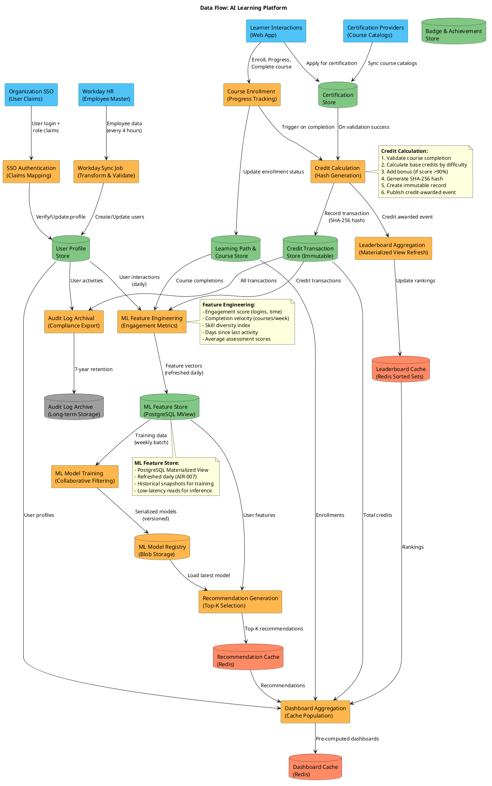

**Data Flow Key Points:**
- **Data Sources**: Workday (employee master), SSO (authentication), Certification Providers (catalogs), User Interactions (web app)
- **Critical Transformations**:
  - **Workday Sync**: ETL every 4 hours with validation (FR-002)
  - **Credit Calculation**: Hash generation for tamper detection (NFR-012)
  - **Leaderboard Aggregation**: 5-minute refresh via materialized views (NFR-015)
  - **ML Feature Engineering**: Daily feature extraction to materialized views (AIR-007)
  - **ML Training**: Weekly batch retraining with collaborative filtering (AIR-005)
- **Data Stores**: PostgreSQL (ACID compliance), Redis (caching), Blob Storage (ML models, files)
- **Compliance**: Audit log archival with 7-year retention (NFR-010)

---

### Logical Data Model (ERD)

Entity-Relationship Diagram showing core entities, attributes, and relationships based on design.md domain entities.

```mermaid
erDiagram
    USER ||--o{ COURSE_ENROLLMENT : "enrolls in"
    USER ||--o{ CREDIT_TRANSACTION : "earns"
    USER ||--o{ USER_BADGE : "awarded"
    USER ||--o{ CERTIFICATION : "applies for"
    USER ||--o{ AUDIT_LOG : "performs actions"
    USER ||--o| LEADERBOARD : "ranked in"
    USER ||--o{ RECOMMENDATION : "receives"
    USER ||--o| ML_FEATURE : "has features"
    USER }o--|| TEAM : "belongs to"
    USER }o--o| USER : "reports to (Manager)"
    
    LEARNING_PATH ||--o{ LEARNING_PATH_COURSE : "contains"
    COURSE ||--o{ LEARNING_PATH_COURSE : "part of"
    COURSE ||--o{ COURSE_ENROLLMENT : "enrolled by users"
    COURSE ||--o{ RECOMMENDATION : "recommended"
    
    BADGE ||--o{ USER_BADGE : "awarded to users"
    
    TEAM ||--o{ LEADERBOARD : "has team ranking"
    TEAM }o--|| USER : "managed by"
    
    CERTIFICATION }o--|| USER : "approved by manager"
    CERTIFICATION }o--|| USER : "validated by admin"
    
    CREDIT_TRANSACTION }o--|| USER : "validated by"
    CREDIT_TRANSACTION }o--|| USER : "awarded to"

    USER {
        uuid UserID PK
        string EmployeeID UK "from Workday"
        string Name
        string Email
        string Department
        uuid ManagerID FK "Self-referential"
        enum Role "Learner, Manager, Admin, Leadership"
        enum EmploymentStatus "Active, Inactive"
        jsonb Skills
        jsonb Interests
        jsonb NotificationPreferences
        timestamp CreatedDate
        timestamp LastLoginDate
    }
    
    LEARNING_PATH {
        uuid LearningPathID PK
        string Name
        text Description
        enum DifficultyLevel "Beginner, Intermediate, Advanced"
        jsonb Prerequisites "Array of LearningPathIDs"
        int TotalCredits
        int EstimatedDuration "minutes"
        timestamp CreatedDate
        boolean IsActive
    }
    
    COURSE {
        uuid CourseID PK
        string Title
        text Description
        enum ContentType "Course, Lab, Assessment, Project"
        enum DifficultyLevel "Beginner, Intermediate, Advanced"
        int BaseCreditValue
        decimal BonusCreditThreshold "Score for bonus"
        int Duration "minutes"
        jsonb Prerequisites
        jsonb Materials "URLs, metadata"
        timestamp CreatedDate
        timestamp UpdatedDate
        boolean IsPublished
    }
    
    LEARNING_PATH_COURSE {
        uuid LearningPathCourseID PK
        uuid LearningPathID FK
        uuid CourseID FK
        int SequenceOrder
        boolean IsMandatory
    }
    
    COURSE_ENROLLMENT {
        uuid EnrollmentID PK
        uuid UserID FK
        uuid CourseID FK
        timestamp EnrollmentDate
        enum Status "Enrolled, InProgress, Completed, Dropped"
        decimal ProgressPercentage
        int TimeSpent "minutes"
        timestamp LastAccessedDate
        timestamp CompletionDate
        decimal FinalScore
        int CreditsAwarded
    }
    
    CREDIT_TRANSACTION {
        uuid TransactionID PK
        uuid UserID FK
        int CreditAmount
        enum Source "Course, Assessment, Project, Certification"
        uuid SourceID "Polymorphic FK"
        timestamp Timestamp
        uuid ValidatorID FK "to User"
        string TransactionHash "SHA-256"
        string PreviousTransactionHash "Blockchain-style"
        jsonb ValidationProof
    }
    
    BADGE {
        uuid BadgeID PK
        string Name
        text Description
        string ImageURL
        enum Category "Skill, Milestone, Time"
        jsonb Criteria "Unlock conditions"
        int Points
        timestamp CreatedDate
        boolean IsActive
    }
    
    USER_BADGE {
        uuid UserBadgeID PK
        uuid UserID FK
        uuid BadgeID FK
        timestamp AwardedDate
        boolean NotificationSent
    }
    
    CERTIFICATION {
        uuid CertificationID PK
        uuid UserID FK "Applicant"
        string ProviderName
        string CourseName
        decimal Cost
        timestamp ApplicationDate
        uuid ManagerID FK "to User"
        enum ManagerApprovalStatus "Pending, Approved, Rejected"
        text RejectionReason
        timestamp CompletionDate
        string ProofURL "Blob Storage"
        enum AdminValidationStatus "Pending, Validated, Failed"
        uuid AdminValidatorID FK "to User"
        int CreditsAllocated
        timestamp CreatedDate
        timestamp UpdatedDate
    }
    
    LEADERBOARD {
        uuid LeaderboardID PK
        uuid UserID FK
        int TotalCredits
        int GlobalRank
        uuid TeamID FK
        int TeamRank
        enum TierLevel "Bronze, Silver, Gold, Platinum, Diamond"
        timestamp LastUpdated
        date SnapshotDate "Historical tracking"
    }
    
    TEAM {
        uuid TeamID PK
        string TeamName
        string Department
        uuid ManagerID FK "to User"
        decimal AverageCredits
        int MemberCount
        int TeamRank
        timestamp CreatedDate
    }
    
    AUDIT_LOG {
        uuid LogID PK
        timestamp Timestamp
        uuid UserID FK
        string IPAddress
        enum ActionType "Login, CreditAward, CourseComplete, etc"
        string EntityType
        uuid EntityID
        jsonb BeforeState
        jsonb AfterState
        string SessionID
        string UserAgent
    }
    
    ML_FEATURE {
        uuid FeatureID PK
        uuid UserID FK
        decimal EngagementScore
        decimal CompletionVelocity
        decimal SkillDiversityIndex
        int DaysSinceLastActivity
        int TotalCoursesCompleted
        decimal AverageCourseScore
        timestamp FeatureTimestamp
    }
    
    RECOMMENDATION {
        uuid RecommendationID PK
        uuid UserID FK
        uuid CourseID FK
        decimal Score "Similarity score"
        int Rank
        string Algorithm "A/B test variant"
        timestamp GeneratedDate
        timestamp ExpiryDate
    }
```

**ERD Key Highlights:**
- **Core Entities**: User, LearningPath, Course, CreditTransaction, Badge, Certification (aligned with design.md)
- **Relationships**:
  - User self-referential for manager hierarchy (ManagerID FK)
  - Many-to-many: User ↔ Course (via CourseEnrollment), LearningPath ↔ Course (via LearningPathCourse)
  - One-to-many: User → CreditTransaction, User → UserBadge, Team → User
- **Data Integrity**:
  - Foreign keys enforce referential integrity (DR-009)
  - Unique constraints on EmployeeID (Workday sync)
  - Enums for controlled vocabularies (Role, Status, DifficultyLevel)
- **Audit Trail**: AuditLog captures before/after state with JSON (DR-007)
- **ML Support**: MLFeature materialized view for feature store (AIR-007), Recommendation table for pre-computed suggestions
- **Performance**: Leaderboard entity with materialized view for sub-2s queries (NFR-001, DR-008)

---

## Use Case Sequence Diagrams

> **Note**: The following sequence diagrams detail the dynamic message flows for each use case defined in [spec.md](.propel/context/docs/spec.md). Each diagram shows interactions between actors, system components, and external systems with timing and data exchanges. Use case diagrams (actor-system boundaries) remain in spec.md per template guidelines.

### UC-001: Learner Enrolls in Learning Path

**Source**: [spec.md - UC-001](.propel/context/docs/spec.md#uc-001-learner-enrolls-in-learning-path)

**Actors**: Learner, Organization SSO, Workday HR System

**Goal**: Begin structured AI upskilling journey by enrolling in appropriate learning path

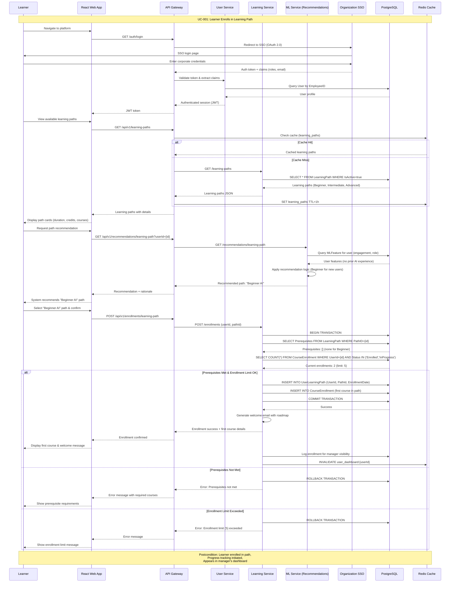

**Key Technical Details:**
- **SSO Integration**: OAuth 2.0 redirect flow with token validation (NFR-004)
- **Recommendation Logic**: ML Service uses user features to recommend Beginner path for new users (FR-009, AIR-001)
- **Caching Strategy**: Learning paths cached in Redis with 1-hour TTL (NFR-001)
- **Transaction Handling**: Database transaction ensures atomicity of enrollment + first course enrollment
- **Validation**: Prerequisites check and enrollment limit (5 courses) enforced (FR-006)

---

### UC-002: Learner Completes Course and Earns Credits

**Source**: [spec.md - UC-002](.propel/context/docs/spec.md#uc-002-learner-completes-course-and-earns-credits)

**Actors**: Learner

**Goal**: Complete course requirements and receive verifiable credits

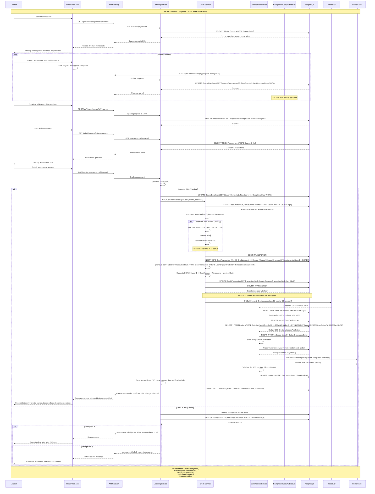

**Key Technical Details:**
- **Auto-save**: Background job saves progress every 5 minutes (NFR-003)
- **Credit Calculation**: Base credits by difficulty + 10% bonus if score ≥90% (FR-010, FR-011)
- **Tamper-Proof Hash**: SHA-256 hash chain with previous transaction hash (NFR-012, DR-004)
- **Event-Driven**: CreditAwarded event published to RabbitMQ for leaderboard update (TR-007, NFR-015)
- **Leaderboard Update**: Materialized view refresh + Redis sorted set update <5 minutes (NFR-015)
- **Badge Assignment**: Criteria evaluation triggers badge unlock (FR-015, FR-016)
- **Tier Progression**: Automatic tier calculation (Bronze/Silver/Gold/Platinum/Diamond) based on total credits (FR-019)

---

### UC-003: Manager Monitors Team Progress

**Source**: [spec.md - UC-003](.propel/context/docs/spec.md#uc-003-manager-monitors-team-progress)

**Actors**: Manager, Workday HR System

**Goal**: Track team skill development and identify areas needing attention

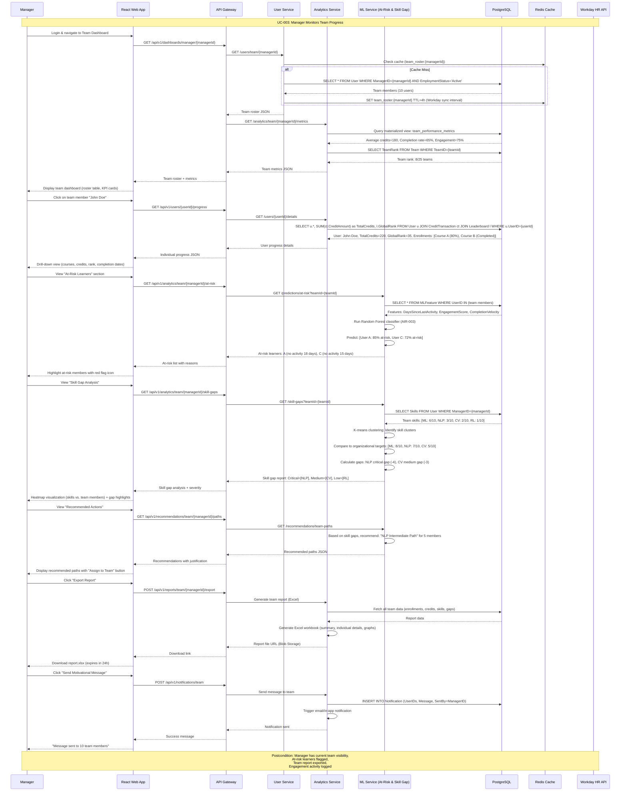

**Key Technical Details:**
- **Team Roster Sync**: Data cached with 4-hour TTL aligned with Workday sync interval (FR-002, NFR-013)
- **At-Risk Prediction**: Random Forest classifier using engagement features (AIR-003, FR-031)
- **Skill Gap Analysis**: K-means clustering compares team skills to organizational targets (AIR-002, FR-032)
- **Dashboard Performance**: Materialized views for team metrics ensure sub-2s load time (NFR-001, DR-008)
- **Report Export**: Excel generation includes graphs, individual details, recommendations (FR-030)

---

### UC-004: Learner Applies for External Certification

**Source**: [spec.md - UC-004](.propel/context/docs/spec.md#uc-004-learner-applies-for-external-certification)

**Actors**: Learner, Manager, Admin, Certification Provider API

**Goal**: Obtain approval and funding for external certification course

```mermaid
sequenceDiagram
    participant Learner
    participant WebApp as React Web App
    participant Gateway as API Gateway
    participant CertSvc as Certification Service
    participant CreditSvc as Credit Service
    participant DB as PostgreSQL
    participant Blob as Azure Blob Storage
    participant ProviderAPI as Certification Provider API
    participant Manager
    participant Admin
    
    Note over Learner,Admin: UC-004: Learner Applies for External Certification

    %% Browse Certification Catalog
    Learner->>WebApp: Navigate to Certifications section
    WebApp->>Gateway: GET /api/v1/certifications/catalog
    Gateway->>CertSvc: GET /certifications/providers
    CertSvc->>DB: SELECT * FROM CertificationProvider WHERE IsApproved=true
    DB-->>CertSvc: Providers: [Coursera, Udacity, Pluralsight]
    
    %% Sync Catalog from Provider API
    CertSvc->>ProviderAPI: GET /api/courses (Coursera API)
    ProviderAPI-->>CertSvc: Course catalog (ML courses, costs, durations)
    CertSvc->>DB: UPSERT INTO CertificationCatalog (weekly sync)
    
    CertSvc-->>Gateway: Catalog of certifications (providers + courses)
    Gateway-->>WebApp: Certification catalog JSON
    WebApp-->>Learner: Display catalog with filters (skill area: ML, NLP, CV)
    
    %% Search and Select Certification
    Learner->>WebApp: Search "Machine Learning Specialization"
    WebApp->>WebApp: Client-side filter catalog
    WebApp-->>Learner: Show results with details (Coursera, $50/month, 6 months, Advanced)
    
    Learner->>WebApp: Select "ML Specialization" & view details
    WebApp-->>Learner: Course details (curriculum, cost=$300 total, 300 credits on completion)
    
    %% Fill Application Form
    Learner->>WebApp: Click "Apply for Certification"
    WebApp-->>Learner: Display application form (provider, course, cost, justification)
    
    Learner->>WebApp: Fill form:
    Note over Learner,WebApp: Provider: Coursera<br/>Course: ML Specialization<br/>Cost: $300<br/>Justification: "Needed for AI project role"
    
    Learner->>WebApp: Submit application
    WebApp->>Gateway: POST /api/v1/certifications/apply
    Gateway->>CertSvc: Create certification application
    
    %% Validate Form Completeness
    CertSvc->>CertSvc: Validate form (required fields: provider, course, cost, justification)
    
    alt Form Valid
        CertSvc->>DB: BEGIN TRANSACTION
        CertSvc->>DB: INSERT INTO Certification (UserID, ProviderName, CourseName, Cost, ApplicationDate, ManagerApprovalStatus='Pending')
        CertSvc->>DB: SELECT ManagerID FROM User WHERE UserID={learnerId}
        DB-->>CertSvc: ManagerID={managerId}
        CertSvc->>DB: COMMIT TRANSACTION
        
        %% Route to Manager for Approval
        CertSvc->>CertSvc: Send notification to manager
        CertSvc->>DB: INSERT INTO Notification (UserID=managerId, Type='CertificationApproval', CertificationID)
        CertSvc-->>Gateway: Application submitted (pending manager approval)
        Gateway-->>WebApp: Success message
        WebApp-->>Learner: "Application submitted, awaiting manager approval"
        
        %% Manager Reviews Application (within 5 business days SLA)
        Manager->>WebApp: Login & navigate to "Certification Approvals"
        WebApp->>Gateway: GET /api/v1/certifications/pending-approvals/{managerId}
        Gateway->>CertSvc: GET /certifications?managerID={managerId}&status=Pending
        CertSvc->>DB: SELECT * FROM Certification WHERE ManagerID={managerId} AND ManagerApprovalStatus='Pending'
        DB-->>CertSvc: Pending certifications (1 application from Learner)
        CertSvc-->>Gateway: Pending applications JSON
        Gateway-->>WebApp: Pending approvals
        WebApp-->>Manager: Display application queue (applicant, course, cost, justification)
        
        Manager->>WebApp: Review application details
        WebApp-->>Manager: Full application with justification and course details
        
        alt Manager Approves
            Manager->>WebApp: Click "Approve" with comments
            WebApp->>Gateway: POST /api/v1/certifications/{id}/approve
            Gateway->>CertSvc: Approve certification
            CertSvc->>DB: UPDATE Certification SET ManagerApprovalStatus='Approved', ManagerComments='Approved for Q2 project'
            CertSvc->>DB: INSERT INTO AuditLog (manager approval action)
            CertSvc-->>Gateway: Approval confirmed
            Gateway-->>WebApp: Success
            WebApp-->>Manager: "Application approved"
            
            %% Notify Learner
            CertSvc->>CertSvc: Send approval notification to learner
            CertSvc->>DB: INSERT INTO Notification (UserID=learnerId, Type='CertificationApproved')
            
            Learner->>WebApp: Receive notification
            WebApp-->>Learner: "Certification approved! Enroll and upload proof upon completion"
            
        else Manager Rejects
            Manager->>WebApp: Click "Reject" with reason
            WebApp->>Gateway: POST /api/v1/certifications/{id}/reject
            Gateway->>CertSvc: Reject certification
            CertSvc->>DB: UPDATE Certification SET ManagerApprovalStatus='Rejected', RejectionReason='Budget constraints, reapply next quarter'
            CertSvc-->>Gateway: Rejection recorded
            
            %% Notify Learner
            CertSvc->>CertSvc: Send rejection notification
            Learner->>WebApp: Receive notification
            WebApp-->>Learner: "Application rejected: Budget constraints. You can reapply."
            
        else Manager Requests More Info
            Manager->>WebApp: Click "Request More Info"
            CertSvc->>DB: UPDATE Certification SET ManagerApprovalStatus='InfoRequested'
            Learner->>WebApp: Receive request, update application
            Note over Learner,WebApp: Resubmit with additional details
        end
        
    else Form Invalid
        CertSvc-->>Gateway: Validation error (missing justification)
        Gateway-->>WebApp: Error response
        WebApp-->>Learner: "Please fill all required fields"
    end
    
    %% Learner Completes Certification (External Provider)
    Note over Learner: Learner enrolls in Coursera, completes course over 6 months
    
    %% Upload Proof of Completion
    Learner->>WebApp: Navigate to "My Certifications"
    WebApp->>Gateway: GET /api/v1/certifications?userId={learnerId}
    Gateway->>CertSvc: GET /certifications/user/{userId}
    CertSvc->>DB: SELECT * FROM Certification WHERE UserID={learnerId}
    DB-->>CertSvc: Certifications (approved, awaiting proof)
    CertSvc-->>Gateway: Certifications JSON
    Gateway-->>WebApp: Certifications list
    WebApp-->>Learner: Show approved certifications with "Upload Proof" button
    
    Learner->>WebApp: Click "Upload Proof" & select certificate PDF
    WebApp->>Gateway: POST /api/v1/certifications/{id}/upload-proof (multipart/form-data)
    Gateway->>CertSvc: Upload proof file
    CertSvc->>Blob: PUT /certificates/{certId}.pdf
    Blob-->>CertSvc: Blob URL
    CertSvc->>DB: UPDATE Certification SET ProofURL={blobUrl}, CompletionDate=NOW(), AdminValidationStatus='Pending'
    CertSvc-->>Gateway: Proof uploaded
    Gateway-->>WebApp: Success
    WebApp-->>Learner: "Proof uploaded, awaiting admin validation"
    
    %% Admin Validates Certification
    Admin->>WebApp: Login & navigate to "Certification Validation Queue"
    WebApp->>Gateway: GET /api/v1/certifications/pending-validation
    Gateway->>CertSvc: GET /certifications?validationStatus=Pending
    CertSvc->>DB: SELECT * FROM Certification WHERE AdminValidationStatus='Pending'
    DB-->>CertSvc: Pending validations
    CertSvc-->>Gateway: Validation queue JSON
    Gateway-->>WebApp: Pending validations
    WebApp-->>Admin: Display queue (learner, course, proof PDF link)
    
    Admin->>WebApp: Review certificate PDF
    WebApp->>Blob: GET /certificates/{certId}.pdf
    Blob-->>WebApp: PDF file
    WebApp-->>Admin: Display PDF in viewer
    
    alt Provider API Available
        Admin->>WebApp: Click "Auto-Validate with Provider API"
        WebApp->>Gateway: POST /api/v1/certifications/{id}/validate-api
        Gateway->>CertSvc: Validate via API
        CertSvc->>ProviderAPI: GET /api/verify?certificateId={certId}
        ProviderAPI-->>CertSvc: Verification response: {isValid: true, completionDate: "2026-03-15"}
        CertSvc->>DB: UPDATE Certification SET AdminValidationStatus='Validated', AdminValidatorID={adminId}
        
    else Manual Validation
        Admin->>WebApp: Click "Manually Validate"
        WebApp->>Gateway: POST /api/v1/certifications/{id}/validate-manual
        Gateway->>CertSvc: Manual validation
        CertSvc->>DB: UPDATE Certification SET AdminValidationStatus='Validated', AdminValidatorID={adminId}
    end
    
    %% Award Credits
    CertSvc->>CreditSvc: POST /credits/award (userId, certificationId, creditsAllocated=300)
    CreditSvc->>DB: INSERT INTO CreditTransaction (UserID, CreditAmount=300, Source='Certification', SourceID=certId, ValidatorID=adminId)
    CreditSvc->>CreditSvc: Generate SHA-256 hash (blockchain-style)
    CreditSvc->>DB: UPDATE CreditTransaction SET TransactionHash={hash}
    CreditSvc-->>CertSvc: Credits awarded
    
    %% Update Certification Record
    CertSvc->>DB: UPDATE Certification SET CreditsAllocated=300
    CertSvc->>DB: INSERT INTO AuditLog (admin validation + credit award)
    
    %% Notify Learner
    CertSvc->>CertSvc: Send congratulations notification
    CertSvc-->>Gateway: Validation complete
    Gateway-->>WebApp: Success
    WebApp-->>Admin: "Certification validated, 300 credits awarded"
    
    Learner->>WebApp: Receive notification
    WebApp-->>Learner: "Congratulations! Certification validated, 300 credits added to your account"
    
    Note over Learner,Admin: Postcondition: Certification approved & tracked,<br/>Credits awarded on completion,<br/>Audit record maintained
```

**Key Technical Details:**
- **Provider Integration**: API sync for course catalogs (FR-024, NFR-014)
- **Approval Workflow**: Manager approval with 5-business-day SLA (FR-021)
- **Proof Storage**: Certificate PDFs stored in Azure Blob Storage (TR-015, DR-006)
- **Validation**: Automatic via provider API with fallback to manual (FR-022)
- **Credit Allocation**: 150-300 credits per certification level (FR-023)
- **Audit Trail**: All approval and validation actions logged (FR-035, NFR-010)

---

### UC-005: Admin Manages Content and Credits

**Source**: [spec.md - UC-005](.propel/context/docs/spec.md#uc-005-admin-manages-content-and-credits)

**Actors**: Admin

**Goal**: Configure platform content, manage credit rules, and maintain data integrity

```mermaid
sequenceDiagram
    participant Admin
    participant WebApp as React Admin Console
    participant Gateway as API Gateway
    participant LearnSvc as Learning Service
    participant CreditSvc as Credit Service
    participant DB as PostgreSQL
    participant Blob as Azure Blob Storage
    participant Cache as Redis Cache
    
    Note over Admin,Cache: UC-005: Admin Manages Content and Credits

    %% Admin Login & Navigate to Admin Console
    Admin->>WebApp: Login & navigate to Admin Console
    WebApp->>Gateway: GET /api/v1/admin/dashboard
    Gateway->>LearnSvc: GET /admin/stats
    LearnSvc->>DB: SELECT COUNT(*) FROM Course, User, CreditTransaction (stats)
    DB-->>LearnSvc: Platform stats (200 courses, 500 users, 15K transactions)
    LearnSvc-->>Gateway: Dashboard stats JSON
    Gateway-->>WebApp: Stats
    WebApp-->>Admin: Display admin dashboard (stats, quick actions)
    
    %% Create New Learning Path
    Admin->>WebApp: Click "Create Learning Path"
    WebApp-->>Admin: Display learning path form
    
    Admin->>WebApp: Fill form:
    Note over Admin,WebApp: Name: "Advanced AI: Deep Learning"<br/>Difficulty: Advanced<br/>Prerequisites: [Intermediate AI]<br/>Description: "Master DL concepts"
    
    Admin->>WebApp: Submit learning path
    WebApp->>Gateway: POST /api/v1/admin/learning-paths
    Gateway->>LearnSvc: Create learning path
    LearnSvc->>DB: BEGIN TRANSACTION
    LearnSvc->>DB: INSERT INTO LearningPath (Name, Description, DifficultyLevel='Advanced', Prerequisites='["UC-LP-002"]')
    DB-->>LearnSvc: LearningPathID={newPathId}
    LearnSvc->>DB: COMMIT TRANSACTION
    LearnSvc-->>Gateway: Learning path created
    Gateway-->>WebApp: Success
    WebApp-->>Admin: "Learning path created successfully"
    
    %% Define Course Metadata
    Admin->>WebApp: Click "Add Course to Path"
    WebApp-->>Admin: Display course form
    
    Admin->>WebApp: Fill course metadata:
    Note over Admin,WebApp: Title: "Convolutional Neural Networks"<br/>ContentType: Course<br/>Difficulty: Advanced<br/>Duration: 480 min<br/>Description: "Learn CNN architectures"
    
    %% Configure Credit Rules
    Admin->>WebApp: Configure credit rules
    WebApp-->>Admin: Display credit configuration
    
    Admin->>WebApp: Set credits:
    Note over Admin,WebApp: BaseCreditValue: 80 (Advanced course)<br/>BonusCreditThreshold: 90% (score for bonus)
    
    alt Use Template
        Admin->>WebApp: Click "Use Template: Advanced Course"
        WebApp->>WebApp: Auto-fill: BaseCredits=80, Bonus=90%
    else Manual Entry
        Admin->>WebApp: Manually enter credit values
    end
    
    %% Add Course Materials
    Admin->>WebApp: Upload course materials (videos, PDFs, labs)
    WebApp->>Gateway: POST /api/v1/admin/courses/{courseId}/materials (multipart upload)
    Gateway->>LearnSvc: Upload materials
    
    loop For each material file
        LearnSvc->>Blob: PUT /course-materials/{courseId}/{filename}
        Blob-->>LearnSvc: Blob URL
    end
    
    LearnSvc->>DB: UPDATE Course SET Materials=jsonb_build_array({urls, types, titles})
    LearnSvc-->>Gateway: Materials uploaded
    Gateway-->>WebApp: Success
    WebApp-->>Admin: "Materials uploaded successfully"
    
    %% Set Prerequisites
    Admin->>WebApp: Set course prerequisites
    WebApp-->>Admin: Display course selector (other courses in catalog)
    Admin->>WebApp: Select prerequisite: "Introduction to Neural Networks"
    WebApp->>Gateway: POST /api/v1/admin/courses/{courseId}/prerequisites
    Gateway->>LearnSvc: Update prerequisites
    LearnSvc->>DB: UPDATE Course SET Prerequisites='["COURSE-NN-001"]'
    LearnSvc-->>Gateway: Prerequisites saved
    Gateway-->>WebApp: Success
    
    %% Publish Course
    Admin->>WebApp: Click "Publish Course"
    WebApp->>Gateway: POST /api/v1/admin/courses/{courseId}/publish
    Gateway->>LearnSvc: Publish course
    
    %% Validation
    LearnSvc->>LearnSvc: Validate course configuration:
    Note over LearnSvc: - Title non-empty<br/>- BaseCreditValue > 0<br/>- Materials uploaded<br/>- Prerequisites valid course IDs
    
    alt Validation Passes
        LearnSvc->>DB: UPDATE Course SET IsPublished=true, UpdatedDate=NOW()
        LearnSvc->>DB: INSERT INTO LearningPathCourse (LearningPathID, CourseID, SequenceOrder=1)
        LearnSvc->>Cache: INVALIDATE learning_paths (force refresh)
        LearnSvc-->>Gateway: Course published
        Gateway-->>WebApp: Success
        WebApp-->>Admin: "Course published and available to learners"
        
    else Validation Fails
        LearnSvc-->>Gateway: Validation errors: [Missing materials]
        Gateway-->>WebApp: Error list
        WebApp-->>Admin: Display validation errors: "Please upload course materials"
    end
    
    %% Review Audit Logs (Compliance)
    Admin->>WebApp: Navigate to "Audit Logs"
    WebApp->>Gateway: GET /api/v1/admin/audit-logs?entity=CreditTransaction&dateRange=last7days
    Gateway->>CreditSvc: GET /audit/credit-transactions
    CreditSvc->>DB: SELECT * FROM AuditLog WHERE EntityType='CreditTransaction' AND Timestamp >= NOW() - INTERVAL '7 days' ORDER BY Timestamp DESC
    DB-->>CreditSvc: Audit logs (500 credit transactions in last 7 days)
    CreditSvc-->>Gateway: Audit logs JSON
    Gateway-->>WebApp: Audit logs
    WebApp-->>Admin: Display audit log table (timestamp, user, action, credits, hash)
    
    %% Investigate Flagged Anomalies
    Admin->>WebApp: Click "Anomalies" tab
    WebApp->>Gateway: GET /api/v1/admin/anomalies?status=flagged
    Gateway->>CreditSvc: GET /anomalies/flagged
    CreditSvc->>DB: SELECT * FROM CreditAnomaly WHERE Status='Flagged' AND ReviewedBy IS NULL
    DB-->>CreditSvc: Anomalies: [User X: 3 advanced courses completed in 2 hours]
    CreditSvc-->>Gateway: Flagged anomalies JSON
    Gateway-->>WebApp: Anomalies
    WebApp-->>Admin: Display anomaly queue with red alerts
    
    Admin->>WebApp: Click on anomaly: "User X - Suspicious completion time"
    WebApp->>Gateway: GET /api/v1/admin/anomalies/{anomalyId}/details
    Gateway->>CreditSvc: Get anomaly details
    CreditSvc->>DB: SELECT cl.*, ce.* FROM CreditAnomaly ca JOIN CreditTransaction ct JOIN CourseEnrollment ce WHERE AnomalyID={id}
    DB-->>CreditSvc: Detailed logs (User X completed 3 courses in 2 hours, impossible timeframe)
    CreditSvc-->>Gateway: Anomaly details + evidence
    Gateway-->>WebApp: Details JSON
    WebApp-->>Admin: Display evidence (course durations, completion timestamps, user activity logs)
    
    alt No Anomaly (False Positive)
        Admin->>WebApp: Click "Clear Flag" with reason
        WebApp->>Gateway: POST /api/v1/admin/anomalies/{id}/clear
        Gateway->>CreditSvc: Clear anomaly
        CreditSvc->>DB: UPDATE CreditAnomaly SET Status='Cleared', ReviewedBy={adminId}, ReviewNotes='Prior incomplete courses, legitimate'
        CreditSvc-->>Gateway: Cleared
        Gateway-->>WebApp: Success
        WebApp-->>Admin: "Anomaly cleared"
        
    else Tampering Confirmed
        Admin->>WebApp: Click "Confirm Tampering" & adjust credits
        WebApp-->>Admin: Display credit adjustment form
        Admin->>WebApp: Revoke fraudulent credits: -240 credits, reason: "API manipulation detected"
        WebApp->>Gateway: POST /api/v1/admin/credits/adjust
        Gateway->>CreditSvc: Adjust credits
        
        %% Credit Adjustment (Requires Second Admin Approval for >50 credits)
        alt Adjustment > 50 credits
            CreditSvc->>DB: INSERT INTO CreditAdjustmentRequest (UserID, Amount=-240, Reason, RequestedBy={adminId}, Status='PendingSecondApproval')
            CreditSvc-->>Gateway: Adjustment requires second admin approval
            Gateway-->>WebApp: Pending approval
            WebApp-->>Admin: "Adjustment queued for second admin approval (>50 credits)"
            
            Note over Admin: Second admin reviews and approves
            Admin->>WebApp: Second admin approves adjustment
            CreditSvc->>DB: BEGIN TRANSACTION
            CreditSvc->>DB: INSERT INTO CreditTransaction (UserID, CreditAmount=-240, Source='AdminAdjustment', ValidatorID={secondAdminId})
            CreditSvc->>DB: UPDATE User SET TotalCredits = TotalCredits - 240
            CreditSvc->>DB: UPDATE CreditAdjustmentRequest SET Status='Approved', ApprovedBy={secondAdminId}
            CreditSvc->>DB: INSERT INTO AuditLog (credit adjustment action)
            CreditSvc->>DB: COMMIT TRANSACTION
            
        else Adjustment <= 50 credits
            CreditSvc->>DB: BEGIN TRANSACTION
            CreditSvc->>DB: INSERT INTO CreditTransaction (UserID, CreditAmount={amount}, Source='AdminAdjustment', ValidatorID={adminId}, Reason={reason})
            CreditSvc->>DB: COMMIT TRANSACTION
            CreditSvc->>DB: INSERT INTO AuditLog (credit adjustment with justification)
        end
        
        CreditSvc-->>Gateway: Credits adjusted
        Gateway-->>WebApp: Success
        WebApp-->>Admin: "Fraudulent credits revoked, user account flagged"
        
        %% Flag User Account
        CreditSvc->>DB: UPDATE User SET AccountStatus='Flagged', FlagReason='Credit tampering detected'
        CreditSvc->>CreditSvc: Send notification to user's manager and HR
    end
    
    Note over Admin,Cache: Postcondition: Course published and available,<br/>Credit rules configured and compliant,<br/>Anomalies investigated and resolved,<br/>Admin actions logged
```

**Key Technical Details:**
- **Content Management**: Courses with metadata, materials (videos/PDFs in Blob), prerequisites (FR-005, FR-007)
- **Credit Configuration**: Template-based or manual credit rule setup (FR-011)
- **Validation**: Course configuration validated before publish (ensures completeness)
- **Audit Logs**: Comprehensive credit transaction history with 7-year retention (FR-035, NFR-010)
- **Anomaly Detection**: Flagged unusual patterns (impossible completion times, credit spikes) for admin review (FR-038)
- **Credit Adjustment Approval**: >50 credits require second admin approval for fraud prevention (DR-004)
- **Blob Storage**: Course materials and certificates stored in Azure Blob (TR-015)

---

### UC-006: Leadership Views AI Readiness Metrics

**Source**: [spec.md - UC-006](.propel/context/docs/spec.md#uc-006-leadership-views-ai-readiness-metrics)

**Actors**: Leadership

**Goal**: Assess organizational AI maturity and make strategic decisions

```mermaid
sequenceDiagram
    participant Leadership
    participant WebApp as React Web App
    participant Gateway as API Gateway
    participant AnalyticsSvc as Analytics Service
    participant MLSvc as ML Service (AI Readiness)
    participant DB as PostgreSQL
    participant Cache as Redis Cache
    
    Note over Leadership,Cache: UC-006: Leadership Views AI Readiness Metrics

    %% Leadership Login & Navigate to Executive Dashboard
    Leadership->>WebApp: Login & navigate to Executive Dashboard
    WebApp->>Gateway: GET /api/v1/dashboards/leadership
    
    %% Display AI Readiness Score
    Gateway->>AnalyticsSvc: GET /analytics/ai-readiness
    AnalyticsSvc->>Cache: Check cache (ai_readiness_score)
    
    alt Cache Miss or Expired
        AnalyticsSvc->>MLSvc: GET /ai-readiness/calculate
        MLSvc->>DB: Query organizational metrics:
        Note over MLSvc,DB: - Enrollment penetration % (enrolled/total employees)<br/>- Average skill levels (Beginner/Intermediate/Advanced)<br/>- Certification completion rate<br/>- Active user engagement rate
        DB-->>MLSvc: Metrics: Enrollment=75%, AvgSkillLevel=Intermediate, CertRate=22%, Engagement=68%
        
        MLSvc->>MLSvc: Calculate AI Readiness Score (0-100):
        Note over MLSvc: Formula: (EnrollmentPenetration * 0.3) +<br/>(SkillLevelIndex * 0.3) +<br/>(CertificationRate * 0.2) +<br/>(EngagementRate * 0.2)
        MLSvc->>MLSvc: Score = (75 * 0.3) + (60 * 0.3) + (22 * 0.2) + (68 * 0.2) = 58.4
        
        MLSvc->>DB: Compare to industry benchmarks
        DB-->>MLSvc: Industry avg: 52, Top quartile: 72
        
        MLSvc-->>AnalyticsSvc: AI Readiness Score=58, Trend=+5 from last quarter, Industry position: Above avg
        AnalyticsSvc->>Cache: SET ai_readiness_score TTL=24h
        
    else Cache Hit
        Cache-->>AnalyticsSvc: Cached AI readiness score
    end
    
    AnalyticsSvc-->>Gateway: AI Readiness Score JSON
    Gateway-->>WebApp: Score + trend data
    WebApp-->>Leadership: Display AI Readiness gauge (58/100) with trend arrow (↑ +5)
    
    %% Analyze Department Performance
    Leadership->>WebApp: View "Department Breakdown"
    WebApp->>Gateway: GET /api/v1/analytics/departments/performance
    Gateway->>AnalyticsSvc: GET /departments/metrics
    AnalyticsSvc->>DB: SELECT Department, AVG(TotalCredits), COUNT(DISTINCT UserID), AVG(EngagementScore) FROM User JOIN MLFeature GROUP BY Department
    DB-->>AnalyticsSvc: Department metrics (Engineering: 85%, Marketing: 45%, Product: 68%)
    AnalyticsSvc-->>Gateway: Department comparison JSON
    Gateway-->>WebApp: Department data
    WebApp-->>Leadership: Display department comparison chart (bar chart: enrollment % by dept)
    
    %% Review Top Performers
    Leadership->>WebApp: View "Top Performing Teams"
    WebApp->>Gateway: GET /api/v1/analytics/teams/top-performers
    Gateway->>AnalyticsSvc: GET /teams/rankings
    AnalyticsSvc->>DB: SELECT TeamName, Department, AverageCredits, TeamRank FROM Team ORDER BY AverageCredits DESC LIMIT 10
    DB-->>AnalyticsSvc: Top teams
    AnalyticsSvc-->>Gateway: Top performers JSON
    Gateway-->>WebApp: Top 10 teams
    WebApp-->>Leadership: Display top teams table (Team Alpha: 320 avg credits, Team Beta: 285, ...)
    
    %% Get AI-Generated Insights
    Leadership->>WebApp: View "AI-Generated Insights"
    WebApp->>Gateway: GET /api/v1/analytics/insights
    Gateway->>MLSvc: GET /insights/organizational
    MLSvc->>DB: Query comprehensive data (skills, enrollments, completions, trends)
    DB-->>MLSvc: Full organizational dataset
    
    MLSvc->>MLSvc: Run AI analysis:
    Note over MLSvc: - Identify skill distribution patterns<br/>- Detect critical gaps (NLP: 35% below target)<br/>- Predict future skill needs<br/>- Correlate training with project success
    
    MLSvc-->>Gateway: Insights JSON:
    Note over Gateway: 1. "Critical NLP skill gap across 60% of teams"<br/>2. "CV skills increasing 15% QoQ (positive trend)"<br/>3. "Teams with 250+ avg credits show 30% higher project success"<br/>4. "Engagement drops after 6 months without new content"
    
    Gateway-->>WebApp: AI insights
    WebApp-->>Leadership: Display insights as cards with severity indicators and recommendations
    
    %% Drill-Down by Skill Domain
    Leadership->>WebApp: Click "Drill-Down: NLP Skills"
    WebApp->>Gateway: GET /api/v1/analytics/skills/nlp
    Gateway->>AnalyticsSvc: GET /skills/domain?domain=NLP
    AnalyticsSvc->>DB: SELECT Users, Courses, Completions WHERE SkillDomain='NLP'
    DB-->>AnalyticsSvc: NLP skill data (180 users enrolled, 65 completed, 22 certifications)
    AnalyticsSvc-->>Gateway: NLP drill-down JSON
    Gateway-->>WebApp: NLP skill details
    WebApp-->>Leadership: Display NLP skill heatmap (by team) + completion funnel
    
    %% View ROI Analysis
    Leadership->>WebApp: View "ROI Analysis"
    WebApp->>Gateway: GET /api/v1/analytics/roi
    Gateway->>MLSvc: GET /roi/calculate
    MLSvc->>DB: Query training investment (certification costs, platform costs)
    DB-->>MLSvc: Total investment: $150K (certifications + platform)
    MLSvc->>DB: Query project delivery metrics (success rate, velocity)
    DB-->>MLSvc: Projects: 45 total, 34 successful (75% success), avg velocity: +20%
    
    MLSvc->>MLSvc: Correlate AI competency with project success:
    Note over MLSvc: Teams with avg 250+ credits:<br/>- Success rate: 88%<br/>- Velocity: +35%<br/>Teams with <150 credits:<br/>- Success rate: 62%<br/>- Velocity: +8%
    
    MLSvc->>MLSvc: Calculate ROI:
    Note over MLSvc: ROI = (Project value improvement - Training cost) / Training cost<br/>= ($500K productivity gain - $150K) / $150K = 233% ROI
    
    MLSvc-->>Gateway: ROI analysis JSON (233% ROI, correlation data)
    Gateway-->>WebApp: ROI report
    WebApp-->>Leadership: Display ROI gauge (233%) + correlation charts (skill level vs. project success)
    
    %% Export Executive Report
    Leadership->>WebApp: Click "Export Executive Report"
    WebApp->>Gateway: POST /api/v1/reports/executive/export
    Gateway->>AnalyticsSvc: Generate executive report
    AnalyticsSvc->>DB: Fetch comprehensive data (AI readiness, departments, top teams, insights, ROI)
    DB-->>AnalyticsSvc: Report data
    AnalyticsSvc->>AnalyticsSvc: Generate PowerPoint with charts, graphs, and executive summary
    AnalyticsSvc->>Blob: PUT /reports/executive-{date}.pptx
    Blob-->>AnalyticsSvc: Report URL
    AnalyticsSvc-->>Gateway: Report download link
    Gateway-->>WebApp: Download URL
    WebApp-->>Leadership: Download executive-report.pptx (expires in 7 days)
    
    %% Set Organizational Targets
    Leadership->>WebApp: Click "Set Quarterly Targets"
    WebApp-->>Leadership: Display target setting form
    
    Leadership->>WebApp: Set targets:
    Note over Leadership,WebApp: Q3 Targets:<br/>- 90% enrollment penetration<br/>- AI Readiness Score: 68<br/>- NLP skill gap: Close by 50%<br/>- 40% certification completion
    
    Leadership->>WebApp: Submit targets
    WebApp->>Gateway: POST /api/v1/targets/organizational
    Gateway->>AnalyticsSvc: Save targets
    AnalyticsSvc->>DB: INSERT INTO OrganizationalTarget (Quarter='Q3-2026', EnrollmentTarget=90, ReadinessTarget=68, NLPGapReduction=50, CertificationTarget=40)
    AnalyticsSvc->>DB: INSERT INTO Notification (notify all managers of new targets)
    AnalyticsSvc-->>Gateway: Targets saved
    Gateway-->>WebApp: Success
    WebApp-->>Leadership: "Q3 targets set and communicated to managers"
    
    Note over Leadership,Cache: Postcondition: Leadership has current AI maturity view,<br/>Strategic decisions informed by data,<br/>Quarterly targets set and communicated,<br/>Executive report generated
```

**Key Technical Details:**
- **AI Readiness Calculation**: Weighted formula combining enrollment, skill levels, certifications, engagement (FR-033, AIR-004)
- **AI-Generated Insights**: ML analysis identifies patterns, gaps, and correlations (FR-031, FR-032)
- **ROI Analysis**: Correlation between AI competency and project success metrics (FR-033)
- **Department Comparison**: Aggregated metrics by department for performance comparison (FR-034)
- **Executive Reporting**: PowerPoint export with charts and executive summary (FR-035)
- **Target Setting**: Quarterly targets cascade to managers and tracked (FR-033)
- **Caching**: AI readiness score cached for 24 hours to reduce computation (NFR-001)

---

### UC-007: System Syncs Employee Data from Workday

**Source**: [spec.md - UC-007](.propel/context/docs/spec.md#uc-007-system-syncs-employee-data-from-workday)

**Actors**: System Scheduler, Workday HR System, Admin

**Goal**: Maintain data consistency between HR system and learning platform

```mermaid
sequenceDiagram
    participant Scheduler as System Scheduler (Cron/Hangfire)
    participant BgJob as Background Job Service
    participant UserSvc as User Service
    participant Workday as Workday HR API
    participant DB as PostgreSQL
    participant Cache as Redis Cache
    participant Admin
    
    Note over Scheduler,Admin: UC-007: System Syncs Employee Data from Workday

    %% Trigger Sync Job (Every 4 Hours)
    Scheduler->>BgJob: Trigger Workday sync job (every 4 hours via cron: 0 */4 * * *)
    BgJob->>BgJob: Log sync start timestamp
    
    %% Authenticate with Workday API
    BgJob->>UserSvc: Initiate Workday sync
    UserSvc->>UserSvc: Retrieve Workday API credentials from Azure Key Vault
    UserSvc->>Workday: POST /auth/token (OAuth 2.0 client credentials)
    
    alt Authentication Success
        Workday-->>UserSvc: Access token (expires in 1 hour)
        
        %% Fetch Employee Delta Changes
        UserSvc->>Workday: GET /api/v1/employees?since={lastSyncTimestamp}&fields=employeeId,name,email,department,manager,role,status
        Note over UserSvc,Workday: Query params:<br/>- since: Last sync timestamp (incremental)<br/>- fields: Required employee attributes
        
        Workday-->>UserSvc: Employee delta response (50 employees changed):
        Note over Workday: Changes:<br/>- 5 new hires<br/>- 3 terminations<br/>- 10 role changes<br/>- 8 manager changes<br/>- 24 other updates (name, email, dept)
        
        %% Validate Data Format
        UserSvc->>UserSvc: Validate data format and completeness
        loop For each employee record
            UserSvc->>UserSvc: Validate required fields (employeeId, name, email)
            UserSvc->>UserSvc: Validate data types (email format, status enum)
            
            alt Valid Record
                UserSvc->>UserSvc: Add to valid batch
            else Invalid Record
                UserSvc->>UserSvc: Quarantine invalid record with error details
                UserSvc->>DB: INSERT INTO SyncError (EmployeeId, ErrorReason, Timestamp)
            end
        end
        
        UserSvc-->>BgJob: Validation complete (47 valid, 3 quarantined)
        
        %% Process Valid Records
        BgJob->>DB: BEGIN TRANSACTION
        
        loop For each valid employee
            BgJob->>DB: SELECT UserID FROM User WHERE EmployeeID={employeeId}
            
            alt Employee Exists (Update)
                DB-->>BgJob: UserID={existingId}
                BgJob->>DB: UPDATE User SET Name={name}, Email={email}, Department={dept}, ManagerID={managerId}, Role={role}, EmploymentStatus={status}, UpdatedDate=NOW() WHERE EmployeeID={employeeId}
                BgJob->>BgJob: Log update action
                
            else New Employee (Create)
                DB-->>BgJob: No user found
                BgJob->>DB: INSERT INTO User (EmployeeID, Name, Email, Department, ManagerID, Role, EmploymentStatus, CreatedDate)
                DB-->>BgJob: UserID={newId}
                BgJob->>BgJob: Queue welcome email for new hire
                BgJob->>BgJob: Log creation action
            end
        end
        
        %% Handle Terminations
        loop For each terminated employee
            BgJob->>DB: UPDATE User SET EmploymentStatus='Inactive', DeactivatedDate=NOW() WHERE EmployeeID={employeeId}
            BgJob->>DB: UPDATE Session SET IsActive=false WHERE UserID={userId} (revoke active sessions)
            BgJob->>BgJob: Log deactivation (retain historical data for audit)
        end
        
        %% Update Manager-Employee Relationships
        loop For each manager change
            BgJob->>DB: UPDATE User SET ManagerID={newManagerId} WHERE EmployeeID={employeeId}
            BgJob->>Cache: INVALIDATE team_roster:{oldManagerId}
            BgJob->>Cache: INVALIDATE team_roster:{newManagerId}
            BgJob->>BgJob: Log manager relationship change
        end
        
        BgJob->>DB: COMMIT TRANSACTION
        DB-->>BgJob: Sync transaction committed
        
        %% Send Welcome Emails to New Hires
        loop For each new hire
            BgJob->>BgJob: Send welcome email with platform introduction and first steps
            BgJob->>DB: INSERT INTO Notification (UserID, Type='Welcome', SentDate)
        end
        
        %% Log Sync Activities
        BgJob->>DB: INSERT INTO SyncLog (SyncType='Workday', StartTime, EndTime, RecordsProcessed=47, RecordsCreated=5, RecordsUpdated=39, RecordsDeactivated=3, RecordsQuarantined=3, Status='Success')
        
        %% Generate Sync Completion Summary
        BgJob->>BgJob: Generate sync summary:
        Note over BgJob: Summary:<br/>- Total processed: 47<br/>- New hires: 5<br/>- Updates: 39<br/>- Terminations: 3<br/>- Quarantined: 3<br/>- Duration: 2.5 minutes
        
        %% Send Summary to Admins
        BgJob->>Admin: Send email notification (sync success summary)
        BgJob->>DB: INSERT INTO Notification (UserID={adminIds}, Type='SyncSummary', Message={summary})
        
        BgJob-->>Scheduler: Sync completed successfully
        
    else Authentication Failed
        Workday-->>UserSvc: 401 Unauthorized
        UserSvc->>UserSvc: Retry authentication (attempt 2/3)
        
        alt Retry Success
            UserSvc->>Workday: Retry POST /auth/token
            Workday-->>UserSvc: Access token
            Note over UserSvc: Continue sync process...
            
        else All Retries Failed
            UserSvc->>DB: INSERT INTO SyncLog (Status='Failed', ErrorReason='Authentication failed after 3 attempts')
            UserSvc->>Admin: Send URGENT alert email (sync failure)
            UserSvc->>BgJob: Schedule retry in 1 hour
            BgJob-->>Scheduler: Sync failed, retry scheduled
        end
    end
    
    %% Handle API Rate Limiting
    alt Workday API Rate Limit Exceeded
        Workday-->>UserSvc: 429 Too Many Requests (Retry-After: 60 seconds)
        UserSvc->>UserSvc: Wait 60 seconds (respect rate limit)
        UserSvc->>Workday: Retry GET /api/v1/employees
        Note over UserSvc: Implement exponential backoff for multiple rate limits
    end
    
    %% Handle Sync Failures
    alt Sync Failure (API error, network issue, database constraint)
        BgJob->>DB: INSERT INTO SyncLog (Status='Failed', ErrorReason={error})
        BgJob->>Admin: Send immediate alert with error details
        BgJob->>BgJob: Schedule retry in 1 hour
        Note over BgJob: NFR-009: 4-hour sync interval with retry on failure
    end
    
    Note over Scheduler,Admin: Postcondition: Employee data synchronized,<br/>User accounts updated with org structure,<br/>Terminated employees deactivated,<br/>New hires onboarded,<br/>Sync status logged and reported
```

**Key Technical Details:**
- **Scheduled Sync**: Cron job every 4 hours (0 */4 * * *) using Hangfire or Azure Functions (FR-002, NFR-009)
- **Incremental Sync**: Delta query using `since={lastSyncTimestamp}` for efficiency (NFR-013)
- **Authentication**: OAuth 2.0 client credentials retrieved from Azure Key Vault (NFR-004, TR-009)
- **Retry Logic**: 3 retry attempts with exponential backoff for API failures (NFR-013 latency requirement)
- **Data Validation**: Format and completeness checks with quarantine for invalid records
- **Transaction Safety**: Database transaction ensures atomicity of bulk updates
- **Deactivation Strategy**: Soft delete (retain historical data) for terminated employees (DR-001, NFR-010)
- **Cache Invalidation**: Team roster caches invalidated on manager changes (TR-006)
- **Error Handling**: Failed records quarantined, sync continues with valid records
- **Admin Notifications**: Email alerts on sync completion (success summary) or failure (urgent alert)

---

### UC-008: System Detects and Prevents Credit Tampering

**Source**: [spec.md - UC-008](.propel/context/docs/spec.md#uc-008-system-detects-and-prevents-credit-tampering)

**Actors**: Tamper Detection System, Admin

**Goal**: Maintain credit system integrity and prevent fraud

```mermaid
sequenceDiagram
    participant TDS as Tamper Detection System (Background Service)
    participant CreditSvc as Credit Service
    participant UserSvc as User Service
    participant DB as PostgreSQL
    participant Cache as Redis Cache
    participant Admin
    participant Manager
    
    Note over TDS,Manager: UC-008: System Detects and Prevents Credit Tampering

    %% Continuous Monitoring (Real-time Stream Processing)
    loop Every 1 minute
        TDS->>DB: SELECT * FROM CreditTransaction WHERE Timestamp >= NOW() - INTERVAL '1 minute' ORDER BY Timestamp DESC
        DB-->>TDS: Recent credit transactions (15 transactions in last minute)
        
        %% Analyze Patterns for Anomalies
        loop For each transaction
            TDS->>TDS: Load user's historical behavior baseline:
            Note over TDS: Baseline patterns:<br/>- Avg credits per day: 10<br/>- Avg course completion time: 120 min<br/>- Typical activity hours: 9am-6pm<br/>- Normal velocity: 1 course/week
            
            TDS->>TDS: Calculate anomaly indicators:
            Note over TDS: Indicators:<br/>1. Credit spike: 90 credits in 2 hours (baseline: 10/day)<br/>2. Completion velocity: 3 advanced courses in 2 hours (normal: 120 min each = 6 hours min)<br/>3. Time pattern: Activity at 3am (unusual hour)<br/>4. Assessment pattern: Perfect scores on all 3 assessments (rare)
            
            %% Detect Suspicious Activity
            alt Anomaly Detected
                TDS->>TDS: Transaction: User completes 3 advanced courses in 2 hours
                TDS->>TDS: Calculate anomaly score:
                Note over TDS: Score formula:<br/>(Credit spike severity * 0.3) +<br/>(Velocity deviation * 0.3) +<br/>(Time pattern anomaly * 0.2) +<br/>(Assessment pattern * 0.2)
                TDS->>TDS: Anomaly Score = 87/100 (HIGH RISK)
                
                alt Score >= 80 (Critical Threshold)
                    %% Freeze Credits
                    TDS->>DB: BEGIN TRANSACTION
                    TDS->>DB: UPDATE User SET CreditsFrozen=true, FreezeReason='Tampering suspected (anomaly score: 87)' WHERE UserID={userId}
                    TDS->>DB: UPDATE CreditTransaction SET Status='Frozen' WHERE UserID={userId} AND Timestamp >= {suspiciousTimeStart}
                    TDS->>DB: COMMIT TRANSACTION
                    
                    %% Generate Anomaly Report
                    TDS->>DB: INSERT INTO CreditAnomaly (UserID, AnomalyScore=87, DetectedTimestamp, Indicators={creditSpike: 90, velocity: 3courses/2h, timePattern: 3am}, Status='Flagged')
                    TDS->>TDS: Compile evidence:
                    Note over TDS: Evidence:<br/>- Transaction IDs: [t1, t2, t3]<br/>- Course completion times: [45 min, 38 min, 42 min] (impossible for 120 min courses)<br/>- API logs: Direct POST to /credits/award (bypassing course completion)<br/>- IP address: Unusual location (VPN detected)
                    
                    %% Send Real-Time Alert (within 1 minute)
                    TDS->>Admin: Send URGENT alert email + Slack notification
                    Note over Admin: Alert: "Credit Tampering Detected<br/>User: John Doe (EID: 12345)<br/>Anomaly Score: 87<br/>Details: 3 advanced courses in 2 hours<br/>Action: Credits frozen, investigation required"
                    
                    TDS->>DB: INSERT INTO Notification (UserID={adminIds}, Type='TamperingAlert', Priority='Critical', Message={alertDetails})
                    
                    Note over TDS: NFR-038: Alert sent within 1 minute of detection
                    
                else Score 60-79 (Medium Risk)
                    %% Log for Review (No Freeze)
                    TDS->>DB: INSERT INTO CreditAnomaly (UserID, AnomalyScore={score}, Status='Review')
                    TDS->>Admin: Send low-priority notification (daily digest)
                    
                else Score < 60 (Low Risk)
                    %% Log Only (No Action)
                    TDS->>DB: INSERT INTO AnomalyLog (UserID, Score={score}, Timestamp)
                    Note over TDS: Logged for pattern analysis, no alert
                end
                
            else Normal Activity
                TDS->>TDS: Pattern within normal bounds, no anomaly
            end
        end
    end
    
    %% Admin Investigates Flagged Activity
    Admin->>WebApp: Login & navigate to "Security Alerts"
    WebApp->>Gateway: GET /api/v1/admin/anomalies?status=Flagged&priority=Critical
    Gateway->>CreditSvc: GET /anomalies/flagged
    CreditSvc->>DB: SELECT * FROM CreditAnomaly WHERE Status='Flagged' ORDER BY AnomalyScore DESC
    DB-->>CreditSvc: Flagged anomalies (1 critical alert: User John Doe)
    CreditSvc-->>Gateway: Anomalies JSON
    Gateway-->>WebApp: Critical alerts
    WebApp-->>Admin: Display alert dashboard with red critical banner
    
    %% Review Detailed Anomaly Report
    Admin->>WebApp: Click on critical alert: "John Doe - Tampering Suspected"
    WebApp->>Gateway: GET /api/v1/admin/anomalies/{anomalyId}/details
    Gateway->>CreditSvc: Get full investigation report
    CreditSvc->>DB: SELECT ca.*, ct.*, al.* FROM CreditAnomaly ca JOIN CreditTransaction ct JOIN APILog al WHERE AnomalyID={id}
    DB-->>CreditSvc: Full evidence:
    Note over CreditSvc: Evidence package:<br/>- Anomaly score: 87<br/>- Credit transactions: 3 x 30 credits<br/>- Course IDs: [ADV-ML-01, ADV-NLP-02, ADV-CV-03]<br/>- Completion times: [45 min, 38 min, 42 min]<br/>- Expected times: [120 min, 150 min, 180 min]<br/>- API logs: Direct POST /api/v1/credits/award (not via course completion)<br/>- User activity logs: No course content access<br/>- IP: 203.0.113.45 (VPN, geo: Russia, unusual for user in US)
    
    CreditSvc-->>Gateway: Investigation package JSON
    Gateway-->>WebApp: Evidence details
    WebApp-->>Admin: Display evidence dashboard (timeline, API logs, IP analysis, pattern charts)
    
    %% Admin Confirms Tampering
    Admin->>WebApp: Review evidence & conclude: API manipulation detected
    Admin->>WebApp: Click "Confirm Tampering"
    WebApp-->>Admin: Display action options (Revoke Credits, Suspend Account, Ban)
    
    %% Revoke Fraudulent Credits
    Admin->>WebApp: Select "Revoke Fraudulent Credits" + Apply temporary suspension
    WebApp->>Gateway: POST /api/v1/admin/credits/revoke
    Gateway->>CreditSvc: Revoke credits
    CreditSvc->>DB: BEGIN TRANSACTION
    
    %% Reverse Credit Transactions
    CreditSvc->>DB: INSERT INTO CreditTransaction (UserID, CreditAmount=-90, Source='AdminRevocation', Reason='API manipulation detected', ValidatorID={adminId})
    CreditSvc->>DB: UPDATE User SET TotalCredits = TotalCredits - 90, AccountStatus='Suspended', SuspensionReason='Credit tampering', SuspensionEndDate=NOW() + INTERVAL '30 days'
    CreditSvc->>DB: UPDATE CreditAnomaly SET Status='Confirmed', ResolvedBy={adminId}, Resolution='Credits revoked, 30-day suspension', ResolvedDate=NOW()
    
    %% Update Leaderboard
    CreditSvc->>Cache: ZADD leaderboard:global {userId} {newTotalCredits} (update Redis sorted set)
    CreditSvc->>DB: Trigger materialized view refresh (leaderboard_global)
    
    %% Apply Account Violation Flag
    CreditSvc->>DB: INSERT INTO UserViolation (UserID, ViolationType='CreditTampering', Severity='Critical', Evidence={evidenceJson}, DetectedDate, ResolvedDate)
    
    %% Log Compliance Incident
    CreditSvc->>DB: INSERT INTO AuditLog (ActionType='CreditRevocation', EntityType='CreditTransaction', EntityID={transactionIds}, PerformedBy={adminId}, BeforeState={credits:90}, AfterState={credits:0}, Timestamp)
    
    CreditSvc->>DB: COMMIT TRANSACTION
    DB-->>CreditSvc: Revocation complete
    
    CreditSvc-->>Gateway: Credits revoked, account suspended
    Gateway-->>WebApp: Success
    WebApp-->>Admin: "90 fraudulent credits revoked, account suspended for 30 days"
    
    %% Notify Stakeholders
    Admin->>WebApp: Click "Notify Manager & HR"
    WebApp->>Gateway: POST /api/v1/notifications/violation
    Gateway->>UserSvc: Send violation notifications
    
    UserSvc->>DB: SELECT ManagerID FROM User WHERE UserID={userId}
    DB-->>UserSvc: ManagerID={managerId}
    
    UserSvc->>Manager: Send email notification:
    Note over Manager: Subject: Security Alert - Team Member Violation<br/>Body: "Your team member John Doe was found<br/>manipulating the credit system via API abuse.<br/>Action: 90 credits revoked, 30-day suspension.<br/>Please schedule a 1-on-1 to discuss."
    
    UserSvc->>HR: Send email notification to HR:
    Note over HR: Subject: Policy Violation - Learning Platform<br/>Body: "Employee John Doe (EID: 12345) violated<br/>platform integrity policy. Evidence: API manipulation.<br/>Action: 30-day suspension, credits revoked.<br/>HR review recommended."
    
    UserSvc-->>Gateway: Notifications sent
    Gateway-->>WebApp: Success
    WebApp-->>Admin: "Manager and HR notified of violation"
    
    %% Quarterly Security Audit Report
    Note over Admin: Quarterly compliance report
    Admin->>WebApp: Navigate to "Compliance Reports"
    WebApp->>Gateway: GET /api/v1/reports/security-audit?period=Q1-2026
    Gateway->>CreditSvc: Generate security audit report
    CreditSvc->>DB: SELECT * FROM CreditAnomaly, UserViolation, AuditLog WHERE Quarter='Q1-2026'
    DB-->>CreditSvc: Quarterly data (12 anomalies detected, 3 confirmed violations, 9 false positives)
    CreditSvc->>CreditSvc: Generate audit report with statistics and trends
    CreditSvc-->>Gateway: Report PDF URL
    Gateway-->>WebApp: Download link
    WebApp-->>Admin: Download Q1-2026-security-audit.pdf
    
    Note over TDS,Manager: Postcondition: Tampering detected and prevented,<br/>Fraudulent credits revoked,<br/>User account flagged/suspended,<br/>Incident documented for compliance,<br/>Manager and HR notified
```

**Key Technical Details:**
- **Real-Time Monitoring**: Background service analyzes credit transactions every 1 minute (FR-037, FR-038)
- **Anomaly Detection**: Machine learning-based anomaly scoring using:
  - Credit spike detection (unusual amounts)
  - Velocity analysis (impossible completion times)
  - Time pattern analysis (unusual activity hours)
  - Assessment pattern analysis (perfect scores, rapid completions)
- **Scoring Algorithm**: Weighted formula (0-100 scale) with thresholds:
  - ≥80: Critical (freeze credits, send urgent alert)
  - 60-79: Medium (flag for review)
  - <60: Low (log only)
- **Freeze Mechanism**: Immediate credit freeze prevents further abuse until investigation (NFR-012)
- **Alert SLA**: Admin notified within 1 minute of detection (NFR-038)
- **Evidence Collection**: Comprehensive investigation package:
  - Transaction logs with timestamps
  - API access logs (detect direct API abuse)
  - IP address analysis (VPN/geo-location anomalies)
  - User activity logs (course content access verification)
- **Credit Revocation**: Negative transaction with audit trail (immutable log)
- **Stakeholder Notification**: Automated alerts to manager and HR (FR-038)
- **Compliance**: Quarterly security audit reports for governance (FR-035, NFR-010)

---

## Summary

This comprehensive design model specification provides:

**Architectural Views Generated:**
1. ✅ **System Context Diagram** (PlantUML) - Boundary, actors, external systems
2. ✅ **Component Architecture Diagram** (Mermaid) - Microservices breakdown with bounded contexts
3. ✅ **Deployment Architecture Diagram** (PlantUML) - Azure cloud hub-and-spoke topology
4. ✅ **Data Flow Diagram** (PlantUML) - Data sources, transformations, stores
5. ✅ **Logical Data Model / ERD** (Mermaid) - 14 core entities with relationships

**Behavioral Models Generated:**
6. ✅ **UC-001 Sequence Diagram**: Learner Enrolls in Learning Path (SSO authentication, ML recommendations, prerequisite validation)
7. ✅ **UC-002 Sequence Diagram**: Learner Completes Course and Earns Credits (auto-save, tamper-proof hashing, event-driven leaderboard)
8. ✅ **UC-003 Sequence Diagram**: Manager Monitors Team Progress (at-risk prediction, skill gap analysis, team analytics)
9. ✅ **UC-004 Sequence Diagram**: Learner Applies for External Certification (approval workflow, provider API integration, credit allocation)
10. ✅ **UC-005 Sequence Diagram**: Admin Manages Content and Credits (content publishing, anomaly investigation, credit adjustment approval)
11. ✅ **UC-006 Sequence Diagram**: Leadership Views AI Readiness Metrics (AI scoring, ROI analysis, executive reporting)
12. ✅ **UC-007 Sequence Diagram**: System Syncs Employee Data from Workday (incremental sync, retry logic, deactivation handling)
13. ✅ **UC-008 Sequence Diagram**: System Detects and Prevents Credit Tampering (real-time anomaly detection, evidence collection, stakeholder notification)

**Traceability:**
- All diagrams reference source requirements from [spec.md](.propel/context/docs/spec.md)
- Architecture aligned with decisions in [design.md](.propel/context/docs/design.md)
- Technology stack: ASP.NET Core 8.0, PostgreSQL 14, React 18, Python ML (FastAPI), Azure Cloud
- NFR compliance: <2s dashboards (NFR-001), 1000+ users (NFR-002), tamper-proof credits (NFR-012), 99.9% uptime (NFR-007)
- Security: SSO integration (NFR-004), RBAC (NFR-006), encryption at rest/transit (NFR-005)

**Document Version**: 1.0  
**Last Updated**: 2026-04-08  
**Status**: Complete - Ready for Development  
**Next Phase**: Implementation Planning and Sprint Breakdown
