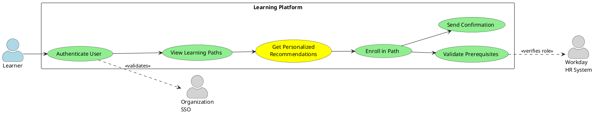
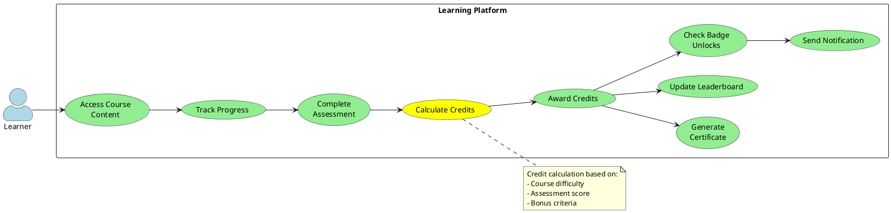
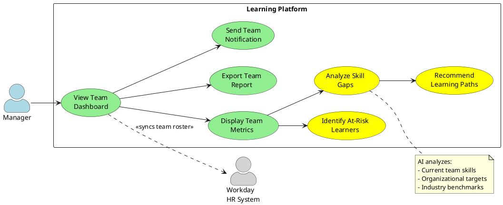
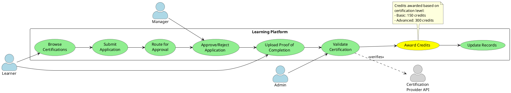
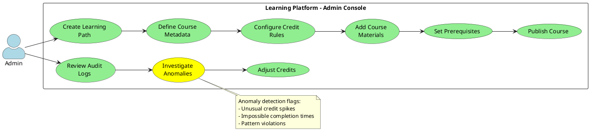
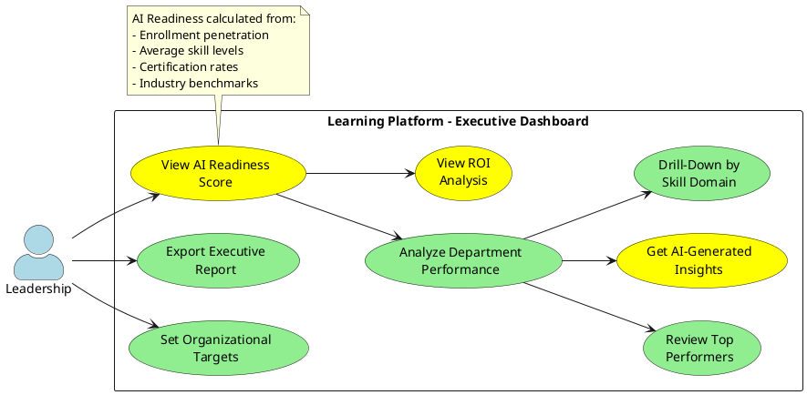
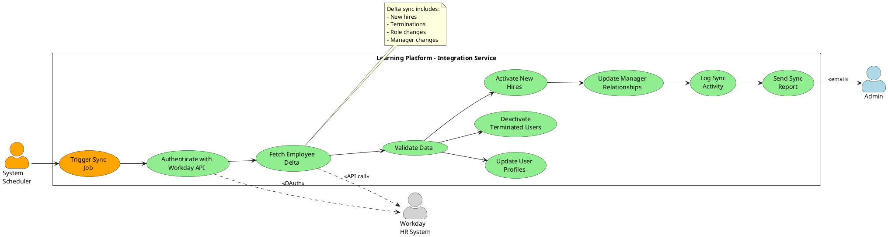
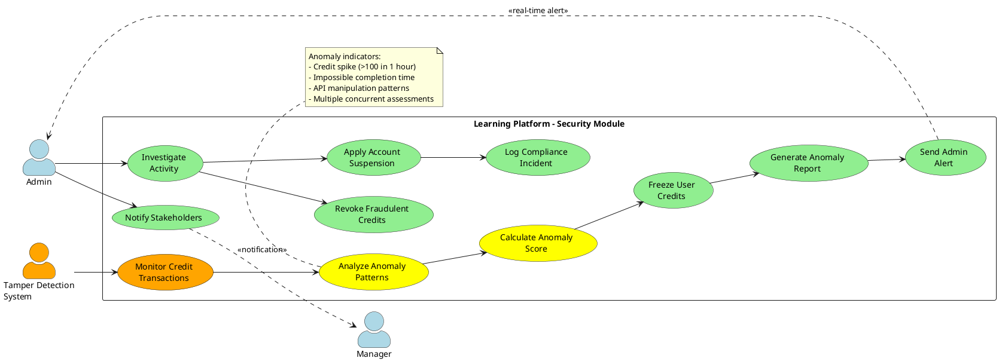

# Requirements Specification: AI-Powered Credit-Based Learning Platform

## Feature Goal

Build a comprehensive web-based learning platform that enables organizational resources to systematically upskill in AI technologies through a credit-based system with gamification elements, ultimately transforming the organization into an AI-native enterprise.

**Current State**: Organization lacks structured AI competency development, no measurable learning metrics, and no visibility into skill progression across engineering teams.

**Desired State**: A fully operational platform where:
- Employees can enroll in structured AI learning paths (Beginner → Intermediate → Advanced)
- Progress is tracked through quantifiable, verifiable, and auditable credits
- Gamification drives engagement through badges, rankings, and leaderboards
- Certification pathways are integrated with approved training providers
- Managers and leadership have visibility into team skill development and organizational AI readiness
- Learning outcomes are aligned with career progression and HR systems (Workday)

## Business Justification

- **Business Value**: Transform organization into AI-native enterprise by systematically building AI competency across all engineering teams, enabling better project delivery and innovation
- **User Impact**: 
  - Engineers gain clear career advancement pathways through verifiable AI skills
  - Managers gain visibility into team capabilities and skill gaps
  - Leadership gains quantifiable metrics on organizational AI readiness
- **Integration with Existing Systems**: 
  - Seamless SSO integration with Organization authentication
  - Bidirectional sync with Workday for employee data and career progression
  - API integration with approved certification providers
- **Problems Solved**:
  - Eliminates ad-hoc, unmeasured learning approaches
  - Provides verifiable proof of AI competency for promotions and role transitions
  - Increases employee engagement through gamification and recognition
  - Gives leadership data-driven insights for strategic planning

## Feature Scope

### In Scope (Phase 1 - MVP)
- Web-based learning platform accessible via modern browsers
- SSO authentication integrated with Organization identity provider
- Credit-based tracking system with audit trails
- Structured learning paths: Beginner → Intermediate → Advanced AI
- Gamification: Badges, ranking system, global and team leaderboards
- Basic certification workflow with approval process
- Individual, Manager, and Leadership dashboards
- Real-time progress tracking and analytics
- Workday employee data synchronization

### Out of Scope (Phase 1)
- Mobile native applications (iOS/Android)
- Deep LMS integration (reserved for Phase 3)
- External marketplace integrations beyond approved providers
- AI-powered chatbot for learning assistance
- Video content creation/hosting (external providers used)
- Community forums and peer-to-peer learning features

### Success Criteria
- [ ] 80% of engineering teams enrolled within 3 months of launch
- [ ] Average of 50+ credits earned per active user within first quarter
- [ ] 95% uptime with dashboard load times under 2 seconds
- [ ] Zero credit tampering incidents with full audit traceability
- [ ] 30% of enrolled users achieve at least one certification within 6 months
- [ ] Leadership dashboard provides real-time AI readiness scores with 99% data accuracy
- [ ] Successful bidirectional sync with Workday with <5 minute data latency

## Functional Requirements

### Functional Requirements Summary Table

| FR-ID | Summary | Classification |
|-------|---------|----------------|
| FR-001 | SSO Authentication | DETERMINISTIC |
| FR-002 | Workday Employee Sync | DETERMINISTIC |
| FR-003 | Role-Based Access Control | DETERMINISTIC |
| FR-004 | User Profile Management | DETERMINISTIC |
| FR-005 | Learning Path Creation | DETERMINISTIC |
| FR-006 | Course Enrollment | DETERMINISTIC |
| FR-007 | Content Type Support | DETERMINISTIC |
| FR-008 | Progress Tracking | DETERMINISTIC |
| FR-009 | Personalized Content Recommendations | AI-CANDIDATE |
| FR-010 | Credit Calculation Engine | DETERMINISTIC |
| FR-011 | Credit Assignment Rules | DETERMINISTIC |
| FR-012 | Credit Verification System | DETERMINISTIC |
| FR-013 | Audit Trail Logging | DETERMINISTIC |
| FR-014 | Credit Transfer Prevention | DETERMINISTIC |
| FR-015 | Badge Assignment System | DETERMINISTIC |
| FR-016 | Achievement Tracking | DETERMINISTIC |
| FR-017 | Global Leaderboard | DETERMINISTIC |
| FR-018 | Team Leaderboard | DETERMINISTIC |
| FR-019 | Ranking Tier Progression | DETERMINISTIC |
| FR-020 | Certification Application Workflow | DETERMINISTIC |
| FR-021 | Manager Approval Process | DETERMINISTIC |
| FR-022 | Certification Validation | DETERMINISTIC |
| FR-023 | Certification Credit Allocation | DETERMINISTIC |
| FR-024 | Provider Integration API | DETERMINISTIC |
| FR-025 | Skill-to-Role Mapping | HYBRID |
| FR-026 | Career Advancement Recommendations | HYBRID |
| FR-027 | Promotion Eligibility Analysis | HYBRID |
| FR-028 | Workday Career Sync | DETERMINISTIC |
| FR-029 | Individual Dashboard | DETERMINISTIC |
| FR-030 | Manager Team Dashboard | DETERMINISTIC |
| FR-031 | Team Performance Analytics | HYBRID |
| FR-032 | Skill Gap Analysis | AI-CANDIDATE |
| FR-033 | Leadership AI Readiness Dashboard | HYBRID |
| FR-034 | Organizational Adoption Metrics | DETERMINISTIC |
| FR-035 | Credit Audit Reports | DETERMINISTIC |
| FR-036 | Certification Records Management | DETERMINISTIC |
| FR-037 | User Activity Monitoring | DETERMINISTIC |
| FR-038 | Tamper Detection System | DETERMINISTIC |

### Detailed Functional Requirements

#### 6.1 Authentication & User Management

- **FR-001**: [DETERMINISTIC] System MUST authenticate users through Organization SSO integration using OAuth 2.0 or SAML 2.0 protocols
  - **Acceptance**: Users can login using corporate credentials; no separate platform credentials required; failed auth attempts logged

- **FR-002**: [DETERMINISTIC] System MUST synchronize employee data from Workday HR system including employee ID, name, department, manager, role, and employment status
  - **Acceptance**: Sync runs every 4 hours; data consistency verified; inactive employees automatically disabled

- **FR-003**: [DETERMINISTIC] System MUST implement role-based access control (RBAC) with four roles: Learner, Manager, Admin, Leadership
  - **Acceptance**: Each role has specific permissions; unauthorized access blocked; role assignments auditable

- **FR-004**: [DETERMINISTIC] System MUST allow users to view and update their profile including bio, skills, interests, and notification preferences
  - **Acceptance**: Profile updates reflected immediately; mandatory fields enforced; change history maintained

#### 6.2 Learning System

- **FR-005**: [DETERMINISTIC] System MUST provide structured learning paths categorized as Beginner, Intermediate, and Advanced AI levels
  - **Acceptance**: Each path has defined prerequisites; sequence enforced; progress tracked per path

- **FR-006**: [DETERMINISTIC] System MUST allow learners to enroll in courses and track enrollment status (enrolled, in-progress, completed, dropped)
  - **Acceptance**: Enrollment date recorded; status transitions logged; concurrent enrollment limit of 5 courses enforced

- **FR-007**: [DETERMINISTIC] System MUST support four content types: Courses, Labs, Assessments, and Projects
  - **Acceptance**: Each type has specific completion criteria; metadata includes duration, difficulty, prerequisites

- **FR-008**: [DETERMINISTIC] System MUST track learner progress within each course including completion percentage, time spent, and last accessed date
  - **Acceptance**: Progress auto-saved every 5 minutes; resume from last position; completion requires 100% of mandatory sections

- **FR-009**: [AI-CANDIDATE] System MUST generate personalized learning content recommendations based on user's role, current skills, learning history, and career goals
  - **Acceptance**: Recommendations updated weekly; minimum 5 relevant suggestions; clickthrough rate tracked; user can dismiss recommendations

#### 6.3 Credit-Based System

- **FR-010**: [DETERMINISTIC] System MUST calculate credits based on course completion (weighted by difficulty), assessment scores (performance-based), and project submissions (quality-assessed)
  - **Acceptance**: Credit calculation formula documented; reproducible results; calculation audit trail maintained

- **FR-011**: [DETERMINISTIC] System MUST enforce credit assignment rules: Beginner courses (10-20 credits), Intermediate courses (30-50 credits), Advanced courses (60-100 credits), Certifications (150-300 credits)
  - **Acceptance**: Credit ranges enforced; bonus credits for high assessment scores (>90%); partial credits not allowed

- **FR-012**: [DETERMINISTIC] System MUST provide verifiable proof of credit earning including completion certificate, timestamp, validation hash, and auditor signature
  - **Acceptance**: Certificates downloadable as PDF; unique verification codes; third-party verification API available

- **FR-013**: [DETERMINISTIC] System MUST maintain comprehensive audit logs for all credit transactions including timestamp, user ID, credit amount, source (course/assessment/project), validator, and transaction hash
  - **Acceptance**: Logs immutable; retained for 7 years; exportable to CSV; searchable by user/date/type

- **FR-014**: [DETERMINISTIC] System MUST prevent credit transfer, credit buying, or credit manipulation through validation checks and integrity monitoring
  - **Acceptance**: Transfer attempts blocked; anomaly detection alerts admins; suspicious patterns flagged for review

#### 6.4 Gamification

- **FR-015**: [DETERMINISTIC] System MUST automatically assign badges when learners meet predefined achievement criteria (skill milestones, credit thresholds, time-based achievements)
  - **Acceptance**: Badge assignment within 1 minute of criteria met; unique badge images; display on profile; shareable

- **FR-016**: [DETERMINISTIC] System MUST track both skill-based achievements (e.g., "ML Beginner", "NLP Expert") and milestone achievements (e.g., "100 Credits Earned", "10 Courses Completed")
  - **Acceptance**: Achievement progress visible; notifications on unlock; achievement history maintained; retroactive assignment for existing progress

- **FR-017**: [DETERMINISTIC] System MUST maintain a global leaderboard ranking all active learners by total credits earned with real-time updates
  - **Acceptance**: Leaderboard updates within 5 minutes of credit award; top 100 displayed; user sees own rank; filterable by time period (week/month/all-time)

- **FR-018**: [DETERMINISTIC] System MUST maintain team leaderboards grouped by department/team showing average credits per team member
  - **Acceptance**: Team rankings based on average, not total; minimum 3 members for team inclusion; manager can view team position

- **FR-019**: [DETERMINISTIC] System MUST implement tier progression system (Bronze: 0-100 credits, Silver: 101-300, Gold: 301-600, Platinum: 601-1000, Diamond: 1001+)
  - **Acceptance**: Tier displayed on profile and leaderboards; tier-up notifications sent; tier benefits documented

#### 6.5 Certification Workflow

- **FR-020**: [DETERMINISTIC] System MUST allow learners to apply for certifications from approved training providers with application form capturing course name, provider, cost, and business justification
  - **Acceptance**: Application form validation; submissions routed to manager; draft applications saveable

- **FR-021**: [DETERMINISTIC] System MUST route certification applications through manager approval workflow with approve/reject/request-more-info actions
  - **Acceptance**: Manager notified within 1 hour; approval decisions logged; rejection requires reason; SLA of 5 business days

- **FR-022**: [DETERMINISTIC] System MUST validate certification completion by accepting certification proof (PDF/image), verifying with provider API (if available), and admin manual verification
  - **Acceptance**: Multiple proof formats supported; verification status tracked; failed verifications return to learner with feedback

- **FR-023**: [DETERMINISTIC] System MUST allocate predefined credits to learner account upon successful certification validation based on certification level
  - **Acceptance**: Credit allocation within 24 hours of validation; allocation notification sent; reflected in leaderboards immediately

- **FR-024**: [DETERMINISTIC] System MUST integrate with approved certification provider APIs to fetch course catalogs, validate completions, and sync certification records
  - **Acceptance**: API integration for minimum 3 providers; weekly catalog sync; completion webhooks supported; fallback to manual verification

#### 6.6 Career Advancement

- **FR-025**: [HYBRID] System MUST map accumulated credits to skill levels (Basic: 0-200, Intermediate: 201-500, Advanced: 501-1000, Expert: 1001+) and recommend role transitions based on skill profiles
  - **Acceptance**: Skill level mapping documented; role requirements defined; recommendations surfaced on dashboard; AI suggests, user/manager confirms

- **FR-026**: [HYBRID] System MUST analyze learner's credits, skill levels, and career goals to recommend promotion opportunities and role transitions
  - **Acceptance**: Recommendations generated monthly; eligibility criteria transparent; user can request analysis; manager review required for promotion submission

- **FR-027**: [HYBRID] System MUST analyze promotion eligibility by comparing current credits/skills against role requirements and flagging readiness
  - **Acceptance**: Eligibility score (0-100) displayed; gap analysis shows missing requirements; AI analysis with manager confirmation

- **FR-028**: [DETERMINISTIC] System MUST sync career advancement data (promotions, role changes, skill certifications) bidirectionally with Workday HR system
  - **Acceptance**: Sync runs daily; conflicts flagged for manual resolution; audit trail maintained; API failure alerts sent

#### 6.7 Dashboard & Analytics

- **FR-029**: [DETERMINISTIC] System MUST provide individual learner dashboard showing total credits earned, current rank, badges earned, courses in progress, upcoming certifications, and personalized recommendations
  - **Acceptance**: Dashboard loads in <2 seconds; real-time data; mobile-responsive; customizable widgets

- **FR-030**: [DETERMINISTIC] System MUST provide manager dashboard displaying team roster, individual team member progress, team average credits, team ranking, and skill gap identification
  - **Acceptance**: Manager sees only their direct reports; exportable to Excel; drill-down to individual details; comparison to org average

- **FR-031**: [HYBRID] System MUST provide team performance analytics including learning velocity trends, skill distribution heatmaps, engagement metrics, and at-risk learner identification
  - **Acceptance**: Visualizations interactive; date range selectable; AI identifies patterns; manager interprets and acts

- **FR-032**: [AI-CANDIDATE] System MUST analyze team skill profiles and identify skill gaps compared to organizational targets and industry benchmarks
  - **Acceptance**: Gap analysis by skill category; severity scoring (critical/medium/low); recommended training paths; quarterly refresh

- **FR-033**: [HYBRID] System MUST provide leadership dashboard showing organizational AI readiness score, adoption metrics across departments, certification completion rates, trending skills, and ROI analysis
  - **Acceptance**: AI readiness score (0-100) with methodology documented; department comparisons; drill-down by team; AI generates insights, leadership reviews

- **FR-034**: [DETERMINISTIC] System MUST track and display organizational adoption metrics including enrollment rate, daily/weekly active users, average credits per user, and course completion rates
  - **Acceptance**: Metrics calculated daily; historical trends displayed; benchmarks against targets; exportable reports

#### 6.8 Audit & Compliance

- **FR-035**: [DETERMINISTIC] System MUST generate comprehensive credit audit reports showing all credit transactions, verification records, anomaly detections, and compliance status
  - **Acceptance**: Reports generated on-demand or scheduled; filterable by user/date/type; PDF and CSV export; digitally signed

- **FR-036**: [DETERMINISTIC] System MUST maintain tamper-proof certification records with blockchain-style hashing, digital signatures, and timestamping
  - **Acceptance**: Records cryptographically secured; modification detection; verification API for external parties; 99.99% integrity guarantee

- **FR-037**: [DETERMINISTIC] System MUST monitor and log all user activities including logins, course access, assessment attempts, credit transactions, and admin actions
  - **Acceptance**: Activity logs detailed; searchable; retention for 3 years; privacy-compliant; anomaly alerts

- **FR-038**: [DETERMINISTIC] System MUST detect tampering attempts through anomaly detection (unusual credit spikes, impossible completion times, pattern violations) and alert administrators
  - **Acceptance**: Detection algorithms defined; real-time analysis; alerts within 15 minutes; suspicious accounts auto-flagged for review

## Use Case Analysis

### Actors & System Boundary

- **Learner (Primary Actor)**: Engineering team member seeking to upskill in AI technologies; enrolls in courses, earns credits, tracks progress, applies for certifications
- **Manager (Primary Actor)**: Team lead or department manager; monitors team progress, approves certification requests, identifies skill gaps, recommends learning paths
- **Admin (Primary Actor)**: Platform administrator; manages content, configures credit rules, maintains certification providers, ensures audit compliance, resolves issues
- **Leadership (Primary Actor)**: C-level executives and senior management; views organizational AI readiness, makes strategic decisions based on analytics, allocates training budgets
- **Workday HR System (System Actor)**: External HR system providing employee master data; bidirectional sync for employee info and career progression
- **Certification Provider API (System Actor)**: External training provider systems; provides course catalogs, validates certifications, sends completion notifications
- **Organization SSO (System Actor)**: Corporate identity provider; authenticates users, provides user attributes, manages sessions

### Use Case Specifications

#### UC-001: Learner Enrolls in Learning Path

- **Actor(s)**: Learner
- **Goal**: Begin structured AI upskilling journey by enrolling in appropriate learning path
- **Preconditions**: 
  - Learner authenticated via SSO
  - Employee profile synced from Workday
  - Learning paths configured in system
- **Success Scenario**: 
  1. Learner logs into platform using corporate SSO credentials
  2. System displays available learning paths (Beginner, Intermediate, Advanced)
  3. Learner views learning path details including courses, duration, credits, prerequisites
  4. System recommends appropriate path based on learner's current role and experience
  5. Learner selects desired learning path and confirms enrollment
  6. System validates prerequisites (if any) and enrolls learner
  7. System displays first recommended course and enrollment confirmation
  8. System sends welcome email with learning path roadmap
- **Extensions/Alternatives**:
  - 4a. If learner has no prior AI experience, system recommends Beginner path
  - 6a. If prerequisites not met, system displays required courses and blocks enrollment
  - 6b. If learner already enrolled in 5 courses, system displays enrollment limit message
- **Postconditions**: 
  - Learner enrolled in learning path
  - Enrollment recorded in database with timestamp
  - Progress tracking initiated
  - Learner appears in manager's team dashboard

##### Use Case Diagram: UC-001

#### UC-002: Learner Completes Course and Earns Credits

- **Actor(s)**: Learner
- **Goal**: Complete course requirements and receive verifiable credits
- **Preconditions**: 
  - Learner enrolled in course
  - Course has defined completion criteria
  - Credit calculation rules configured
- **Success Scenario**: 
  1. Learner accesses course materials and progresses through modules
  2. System auto-saves progress every 5 minutes
  3. Learner completes all mandatory sections (lectures, labs, readings)
  4. System marks course completion status as 100%
  5. Learner takes final assessment and achieves passing score (≥70%)
  6. System calculates credits based on course difficulty and assessment score
  7. System awards credits to learner account with verification hash
  8. System generates completion certificate with unique verification code
  9. System updates learner's total credits and recalculates leaderboard position
  10. System checks for badge/tier unlocks and awards if criteria met
  11. System sends congratulatory notification with certificate download link
- **Extensions/Alternatives**:
  - 5a. If assessment score <70%, learner can retry after 24 hours
  - 5b. After 3 failed attempts, learner must retake course content
  - 6a. If bonus credit criteria met (score ≥90%), system adds 10% bonus credits
  - 10a. If no badges/tiers unlocked, system recommends next course
- **Postconditions**: 
  - Course marked as completed in learner's profile
  - Credits added to learner's account with audit trail
  - Completion certificate generated and available for download
  - Leaderboards updated to reflect new credit total
  - Manager notified of team member's completion

##### Use Case Diagram: UC-002

#### UC-003: Manager Monitors Team Progress

- **Actor(s)**: Manager
- **Goal**: Track team skill development and identify areas needing attention
- **Preconditions**: 
  - Manager authenticated with manager role
  - Manager has team members assigned in Workday
  - Team members enrolled in courses
- **Success Scenario**: 
  1. Manager logs into platform and navigates to Team Dashboard
  2. System displays team roster with current enrollment status
  3. System shows team performance metrics (average credits, completion rate, engagement)
  4. Manager views individual team member progress drill-down
  5. System highlights at-risk learners (no activity in 14 days)
  6. System displays AI-generated skill gap analysis for team
  7. Manager reviews recommended learning paths to address gaps
  8. Manager exports team report for review meeting
  9. Manager sends motivational message to team through platform
- **Extensions/Alternatives**:
  - 4a. Manager clicks individual member to see detailed progress
  - 5a. If at-risk learners detected, manager can send reminder notification
  - 6a. Manager can request custom skill gap analysis for specific AI domains
  - 8a. Report export includes graphs, individual details, recommendations
- **Postconditions**: 
  - Manager has current visibility into team progress
  - At-risk learners flagged for follow-up
  - Team report generated and exported
  - Engagement activity logged for manager

##### Use Case Diagram: UC-003

#### UC-004: Learner Applies for External Certification

- **Actor(s)**: Learner, Manager, Admin
- **Goal**: Obtain approval and funding for external certification course
- **Preconditions**: 
  - Learner authenticated
  - Certification providers configured in system
  - Manager approval workflow active
- **Success Scenario**: 
  1. Learner navigates to Certifications section
  2. System displays catalog of approved certification providers and courses
  3. Learner searches/filters certifications by skill area (ML, NLP, Computer Vision)
  4. Learner selects desired certification and views details (cost, duration, provider)
  5. Learner fills application form with business justification
  6. System validates form completeness and submits to manager queue
  7. Manager receives notification and reviews application within 5 business days
  8. Manager approves application with comments
  9. System notifies learner of approval and provides enrollment instructions
  10. Learner completes certification through provider platform
  11. Learner uploads proof of completion (certificate PDF)
  12. Admin validates certification against provider records
  13. System awards predefined credits to learner account
  14. System updates certification records and sends congratulations
- **Extensions/Alternatives**:
  - 6a. If form incomplete, system highlights missing fields
  - 8a. If manager rejects, learner receives rejection reason and can reapply after addressing gaps
  - 8b. If manager requests more info, learner updates application and resubmits
  - 12a. If provider has API, system auto-validates; otherwise admin manually verifies
  - 12b. If validation fails, learner notified to provide alternate proof
- **Postconditions**: 
  - Certification application approved and tracked
  - Learner enrolled in external certification
  - Credits awarded upon successful completion
  - Certification record maintained in audit system

##### Use Case Diagram: UC-004

#### UC-005: Admin Manages Content and Credits

- **Actor(s)**: Admin
- **Goal**: Configure platform content, manage credit rules, and maintain data integrity
- **Preconditions**: 
  - Admin authenticated with admin role
  - Platform operational
- **Success Scenario**: 
  1. Admin logs into administration console
  2. Admin navigates to Content Management section
  3. Admin creates new learning path with sequence of courses
  4. Admin defines course metadata (title, description, difficulty, duration)
  5. Admin configures credit rules for course (base credits, bonus thresholds)
  6. Admin adds course materials (videos, documents, labs, assessments)
  7. Admin sets prerequisites and completion criteria
  8. Admin publishes course to make available to learners
  9. System validates course configuration and activates course
  10. Admin reviews audit logs for recent credit transactions
  11. Admin investigates flagged anomalies (unusual credit patterns)
  12. Admin adjusts credit allocation if error detected and logs justification
- **Extensions/Alternatives**:
  - 5a. Admin can use template for standard credit rules
  - 9a. If validation fails, system lists errors for admin to correct
  - 11a. If no anomalies, admin confirms compliance status
  - 12a. Credit adjustments require second admin approval for amounts >50 credits
- **Postconditions**: 
  - New course published and available to learners
  - Credit rules configured and audit-compliant
  - Anomalies investigated and resolved
  - Admin actions logged for compliance

##### Use Case Diagram: UC-005

#### UC-006: Leadership Views AI Readiness Metrics

- **Actor(s)**: Leadership
- **Goal**: Assess organizational AI maturity and make strategic decisions
- **Preconditions**: 
  - Leadership authenticated with leadership role
  - Sufficient enrollment data available (minimum 30 days)
  - AI readiness algorithms configured
- **Success Scenario**: 
  1. Leadership logs into platform and navigates to Executive Dashboard
  2. System displays organizational AI readiness score (0-100) with trend graph
  3. System shows department-wise breakdown of enrollment and completion rates
  4. Leadership views top-performing teams and lagging departments
  5. System presents AI-generated insights on skill distribution and gaps
  6. Leadership drills down into specific AI skill domains (ML, NLP, CV, etc.)
  7. System displays ROI analysis (training investment vs. project delivery improvement)
  8. Leadership exports comprehensive report for board presentation
  9. Leadership sets organizational skill targets for next quarter
  10. System confirms targets and assigns tracking metrics
- **Extensions/Alternatives**:
  - 5a. If critical skill gaps detected, system recommends targeted training initiatives
  - 7a. ROI calculation includes project success rate correlation with team AI competency
  - 9a. Targets cascade to departments and notify managers
- **Postconditions**: 
  - Leadership has current view of organizational AI maturity
  - Strategic decisions informed by data-driven insights
  - Quarterly targets set and communicated
  - Executive report generated

##### Use Case Diagram: UC-006

#### UC-007: System Syncs Employee Data from Workday

- **Actor(s)**: Workday HR System, Admin
- **Goal**: Maintain data consistency between HR system and learning platform
- **Preconditions**: 
  - Workday API integration configured
  - API credentials valid
  - Sync schedule active (every 4 hours)
- **Success Scenario**: 
  1. System scheduler triggers Workday sync job at configured interval
  2. System authenticates with Workday API using OAuth credentials
  3. System fetches employee delta changes (new hires, role changes, terminations, manager changes)
  4. System validates data format and completeness
  5. System matches employees by unique employee ID
  6. System updates user profiles with new data (name, department, manager, role)
  7. System deactivates accounts for terminated employees
  8. System activates accounts for new hires and sends welcome email
  9. System updates manager-employee relationships
  10. System logs all sync activities with success/failure status
  11. System sends sync completion summary to admins
- **Extensions/Alternatives**:
  - 2a. If API authentication fails, system retries 3 times then alerts admin
  - 4a. If data validation fails, system quarantines invalid records and continues with valid records
  - 5a. If employee ID not found, system creates new user account
  - 7a. Deactivated accounts retain audit history but cannot login
  - 10a. If sync fails, system sends immediate alert and schedules retry in 1 hour
- **Postconditions**: 
  - Employee data synchronized with Workday
  - User accounts updated with current organizational structure
  - Terminated employees deactivated
  - New hires onboarded
  - Sync status logged and reported

##### Use Case Diagram: UC-007

#### UC-008: System Detects and Prevents Credit Tampering

- **Actor(s)**: Tamper Detection System, Admin
- **Goal**: Maintain credit system integrity and prevent fraud
- **Preconditions**: 
  - Anomaly detection algorithms active
  - Baseline user behavior patterns established
  - Admin alert configurations set
- **Success Scenario**: 
  1. Tamper detection system continuously monitors credit transactions
  2. System analyzes patterns for anomalies (unusual credit spikes, impossible completion times)
  3. System detects suspicious activity: User completes 3 advanced courses in 2 hours
  4. System calculates anomaly score based on deviation from normal patterns
  5. System flags transaction and freezes further credit awards for user
  6. System generates detailed anomaly report with evidence
  7. System sends real-time alert to admin within 1 minute
  8. Admin reviews flagged activity and investigates user action logs
  9. Admin confirms tampering attempt (API manipulation detected)
  10. Admin revokes fraudulent credits and applies account suspension
  11. System updates user record with violation flag
  12. System logs incident for compliance reporting
  13. Admin notifies user's manager and HR
- **Extensions/Alternatives**:
  - 4a. If anomaly score <threshold, system logs for review but doesn't freeze
  - 9a. If investigation finds legitimate activity (e.g., prior incomplete courses), admin clears flag
  - 10a. For severe violations, admin can permanently ban account
  - 13a. Incident included in quarterly security audit report
- **Postconditions**: 
  - Tampering attempt detected and prevented
  - Fraudulent credits revoked
  - User account flagged/suspended
  - Incident documented for compliance
  - Manager and HR notified

##### Use Case Diagram: UC-008

## Risks & Mitigations

### Top 5 Risks (Scoped to Functional Requirements)

1. **Low User Adoption Despite Gamification**
   - **Risk**: Gamification elements may not drive sustained engagement if not aligned with intrinsic motivation
   - **Mitigation**: 
     - Conduct user research to understand true motivators (career growth focus)
     - Implement leadership-driven mandates and tie learning to performance reviews
     - A/B test gamification mechanics and iterate based on engagement metrics
     - Provide tangible career benefits (promotions, role transitions) linked to credits
   - **Severity**: High | **Likelihood**: Medium

2. **Workday Integration Data Sync Failures**
   - **Risk**: API failures, data format changes, or network issues causing employee data inconsistencies
   - **Mitigation**: 
     - Implement robust error handling with automatic retry logic (exponential backoff)
     - Build reconciliation reports to identify sync gaps daily
     - Maintain local cache with eventual consistency model
     - Establish SLA with IT for Workday API uptime and response times
     - Alert admins immediately on sync failures with fallback to manual updates
   - **Severity**: High | **Likelihood**: Medium

3. **Credit System Gaming and Fraud**
   - **Risk**: Users exploit loopholes to artificially inflate credits (assessment manipulation, API abuse, collusion)
   - **Mitigation**: 
     - Implement multi-layered anomaly detection with behavioral analysis
     - Require manager validation for high-value certifications
     - Use cryptographic hashing for tamper-proof credit records
     - Conduct random audits of high-credit earners
     - Implement rate limiting on assessments and course completions
     - Severe penalties (account suspension, HR escalation) for confirmed fraud
   - **Severity**: High | **Likelihood**: Medium

4. **Scalability Issues with Concurrent Users**
   - **Risk**: Platform performance degrades during peak usage (e.g., end-of-quarter certification rush) affecting user experience
   - **Mitigation**: 
     - Design microservices architecture with independent scaling of components
     - Implement caching layers (Redis) for frequently accessed data (leaderboards, dashboards)
     - Use CDN for static content delivery
     - Load test platform for 2x expected peak concurrent users
     - Auto-scaling policies for compute resources in cloud deployment
     - Queue-based architecture for credit calculations to handle spikes
   - **Severity**: Medium | **Likelihood**: High

5. **External Certification Provider Integration Delays**
   - **Risk**: Provider API unavailability, documentation gaps, or custom integration requirements delaying Phase 1 launch
   - **Mitigation**: 
     - Prioritize providers with well-documented REST APIs and existing integrations
     - Build manual verification workflow as fallback for API failures
     - Start integration POC in parallel with platform development
     - Maintain provider catalog even without API (manual catalog upload)
     - Define minimum viable provider integration (1 automated + 2 manual) for MVP
     - Contract SLAs with providers for API uptime and support
   - **Severity**: Medium | **Likelihood**: High

## Constraints & Assumptions

### Top 5 Constraints (Scoped to Functional Requirements)

1. **Organization SSO Integration Mandatory**
   - **Constraint**: Platform MUST use existing Organization SSO; no custom authentication allowed
   - **Rationale**: IT security policy requires centralized identity management; simplifies user access; reduces security vulnerabilities
   - **Impact**: Cannot implement platform-specific auth features like password policies or MFA; dependent on SSO provider capabilities

2. **Workday as Single Source of Truth for Employee Data**
   - **Constraint**: All employee master data MUST sync from Workday; platform cannot create/modify employee records independently
   - **Rationale**: HR governance requires Workday as authoritative system for org structure; ensures data consistency across enterprise
   - **Impact**: Platform dependent on Workday API availability; cannot onboard users faster than sync frequency; conflicts resolved in favor of Workday data

3. **Credit System Must Be Tamper-Proof and Auditable**
   - **Constraint**: All credit transactions MUST be immutable with cryptographic verification; audit logs retained for 7 years
   - **Rationale**: Compliance requirement for career advancement decisions; potential legal disputes over promotions; financial implications of training budgets
   - **Impact**: Cannot allow admin credit corrections without extensive justification and approval workflow; storage costs for long-term log retention

4. **Phase 1 Excludes Mobile Native Applications**
   - **Constraint**: MVP delivery limited to responsive web application; native iOS/Android apps out of scope
   - **Rationale**: Budget and timeline constraints; prioritize core functionality over cross-platform development
   - **Impact**: User experience limitations on mobile devices; cannot leverage native device features (push notifications, offline mode); potential adoption impact

5. **Performance SLA: Dashboard Load <2 Seconds**
   - **Constraint**: All dashboards (Individual, Manager, Leadership) MUST load within 2 seconds at 95th percentile
   - **Rationale**: User experience requirement; competitive with existing learning platforms (Microsoft Learn, Google Learn); engagement correlation with performance
   - **Impact**: Requires aggressive caching, query optimization, and potentially data denormalization; limits dashboard complexity and widget count

### Top 5 Assumptions (Scoped to Functional Requirements)

1. **Approved Certification Providers Have APIs**
   - **Assumption**: At least 3 major certification providers (e.g., Coursera, Udacity, Pluralsight) offer REST APIs for course catalog and completion verification
   - **Validation**: Conduct API discovery and documentation review during planning phase
   - **Risk if Invalid**: Fall back to manual verification workflow; increased admin burden; slower credit allocation

2. **Organization SSO Supports OAuth 2.0 or SAML 2.0**
   - **Assumption**: Corporate SSO provider implements industry-standard OAuth 2.0 or SAML 2.0 protocols
   - **Validation**: Confirm with IT infrastructure team; review SSO provider documentation
   - **Risk if Invalid**: May require custom authentication integration; potential security review delays; increased development effort

3. **Users Have Basic Web Literacy**
   - **Assumption**: Target users (engineering teams) comfortable with web applications; familiar with concepts like dashboards, profiles, notifications
   - **Validation**: User research sessions with representative learners
   - **Risk if Invalid**: Requires additional onboarding tutorials, help documentation, and support resources; potential adoption friction

4. **Leadership Mandate Drives Adoption**
   - **Assumption**: C-level executives and senior management will actively promote platform usage and tie learning to performance reviews
   - **Validation**: Secure executive sponsorship and communication plan before launch
   - **Risk if Invalid**: Adoption relies solely on intrinsic motivation and gamification; may not achieve 80% enrollment target

5. **Workday API Access Available with Sufficient Rate Limits**
   - **Assumption**: Workday API accessible with permissions for employee read operations; rate limits accommodate sync frequency (every 4 hours) and user base size
   - **Validation**: Review Workday API documentation; confirm with HR IT team; test API access in dev environment
   - **Risk if Invalid**: May need to reduce sync frequency; batch operations differently; implement request queuing; potential data staleness

---

**Document Version**: 1.0  
**Last Updated**: 2026-04-08  
**Status**: Draft - Pending Review
